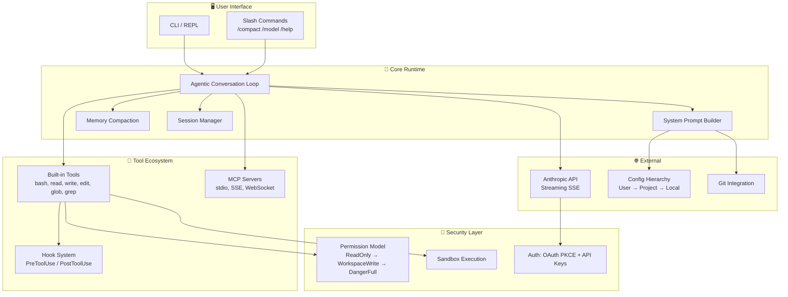
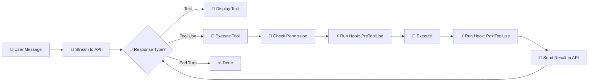
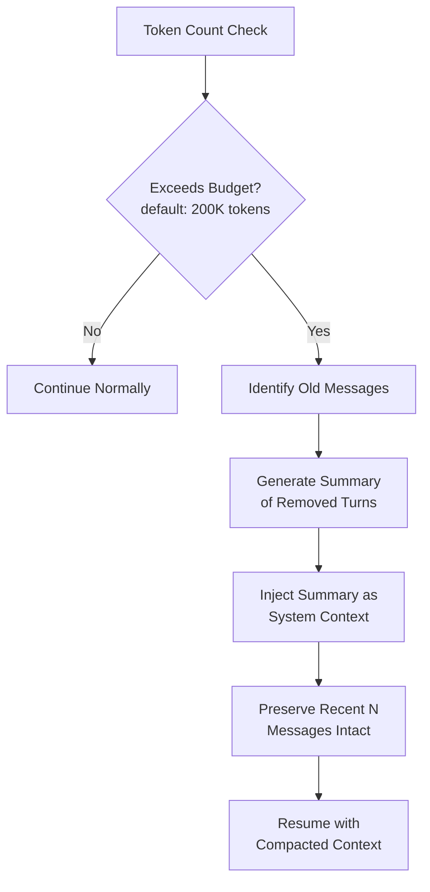
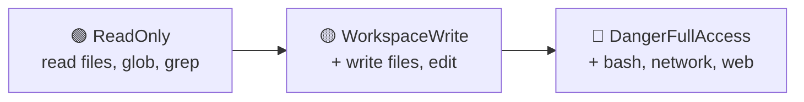

<p align="center">
  
</p>

<h1 align="center">Inside Claude Code</h1>

<p align="center">
  <strong>Architecture Deep Dive &bull; Flow Diagrams &bull; How Every Feature Works Under the Hood</strong>
</p>

<p align="center">
  <a href="#-what-is-this"></a>
  <a href="#-architecture-map"></a>
  <a href="#-deep-dives"></a>
  <a href="https://github.com/Luxshan2000/inside-claude-code/stargazers"></a>
  <a href="https://github.com/Luxshan2000/inside-claude-code/blob/main/LICENSE"></a>
</p>

<p align="center">
  <em>Ever wondered how Claude Code actually works? How it shrinks memory, executes tools, manages permissions, or streams responses? This repo breaks it all down — one diagram at a time.</em>
</p>

---

## 🧠 What Is This?

**Claude Code** (and its open-source sibling **Claw Code**) is an agentic AI coding assistant that lives in your terminal. It can read files, write code, run commands, search the web, and orchestrate complex multi-step tasks — all while managing context, permissions, and tool execution autonomously.

**This repository is a visual architecture guide.** No code. Just diagrams, explanations, and deep dives into every subsystem that makes the magic happen.

Whether you're:
- 🏗️ **Building your own AI agent** and want to learn from Claude Code's architecture
- 🔍 **Curious about how agentic loops work** under the hood
- 📚 **Studying software architecture** patterns in production AI systems
- 🛠️ **Contributing to Claw Code / Claude Code** and need to understand the internals

...this repo is for you.

---

## 🏗️ Architecture Map

> **The 30,000-foot view.** How all the pieces fit together.



**[📖 Full Architecture Overview →](docs/00-architecture-overview/README.md)**

---

## 🔬 Deep Dives

Each doc below zooms into **one specific feature** with flow diagrams, sequence diagrams, and detailed explanations.

| # | Feature | What You'll Learn | Status |
|---|---------|-------------------|--------|
| 00 | [**Architecture Overview**](docs/00-architecture-overview/README.md) | High-level system design, crate structure, data flow | ✅ |
| 01 | [**The Agentic Conversation Loop**](docs/01-conversation-loop/README.md) | How the core loop streams, calls tools, and iterates | ✅ |
| 02 | [**Memory Shrinking & Context Compaction**](docs/02-memory-and-context/README.md) | How Claude Code fits infinite conversations into finite context | ✅ |
| 03 | [**Tool System**](docs/03-tool-system/README.md) | Tool registration, execution, input schemas, built-in tools | ✅ |
| 04 | [**Permission Model**](docs/04-permission-model/README.md) | Three-tier authorization, interactive prompting, escalation | ✅ |
| 05 | [**MCP Integration**](docs/05-mcp-integration/README.md) | Model Context Protocol — extending tools via external servers | ✅ |
| 06 | [**Hook System**](docs/06-hook-system/README.md) | Pre/Post tool hooks, exit codes, environment variables | ✅ |
| 07 | [**Session Management**](docs/07-session-management/README.md) | Persistence, resume, message serialization | ✅ |
| 08 | [**Streaming & SSE Parsing**](docs/08-streaming-and-sse/README.md) | Server-Sent Events, incremental parsing, real-time output | ✅ |
| 09 | [**Configuration System**](docs/09-config-system/README.md) | Multi-level config, deep merge, feature extraction | ✅ |
| 10 | [**Authentication**](docs/10-authentication/README.md) | OAuth PKCE flow, API keys, token refresh | ✅ |
| 11 | [**CLI & REPL**](docs/11-cli-and-repl/README.md) | Terminal rendering, markdown output, input handling | ✅ |
| 12 | [**Sandbox Execution**](docs/12-sandbox-execution/README.md) | Linux namespace isolation, container detection | ✅ |
| 13 | [**System Prompt Building**](docs/13-system-prompt-building/README.md) | Dynamic prompt construction, CLAUDE.md discovery | ✅ |
| 14 | [**Slash Commands**](docs/14-slash-commands/README.md) | Command registry, parsing, execution | ✅ |
| 15 | [**Error Handling & Retry**](docs/15-error-handling-and-retry/README.md) | Error types, exponential backoff, retryability | ✅ |
| 16 | [**Bootstrap Lifecycle**](docs/16-bootstrap-lifecycle/README.md) | Startup phases, initialization sequence | ✅ |

---

## 🧩 Key Concepts at a Glance

### The Conversation Loop — *The beating heart*



### Memory Compaction — *How infinite conversations fit in finite context*



### Permission Tiers — *Security by design*



---

## 📊 System at a Glance

| Component | Details |
|-----------|---------|
| **Modular Architecture** | Separate modules for API, commands, runtime core, CLI, and tools |
| **Built-in Tools** | 18 tools — file ops, shell, search, web, orchestration |
| **MCP Transports** | 6 types — stdio, SSE, HTTP, WebSocket, SDK, proxy |
| **Permission Tiers** | 3 levels — ReadOnly, WorkspaceWrite, DangerFullAccess |
| **Config Sources** | 5 locations — user, project, local, CLI flags, env vars |
| **Slash Commands** | 15+ — /compact, /model, /permissions, /cost, /diff, and more |
| **Bootstrap Phases** | 12 ordered startup phases |
| **Supported Models** | Opus, Sonnet, Haiku model families |

---

## 🗂️ Repository Structure

```
inside-claude-code/
├── README.md                              ← You are here
├── LICENSE
├── assets/
│   └── banner.svg
├── docs/
│   ├── 00-architecture-overview/          ← Start here
│   ├── 01-conversation-loop/
│   ├── 02-memory-and-context/
│   ├── 03-tool-system/
│   ├── 04-permission-model/
│   ├── 05-mcp-integration/
│   ├── 06-hook-system/
│   ├── 07-session-management/
│   ├── 08-streaming-and-sse/
│   ├── 09-config-system/
│   ├── 10-authentication/
│   ├── 11-cli-and-repl/
│   ├── 12-sandbox-execution/
│   ├── 13-system-prompt-building/
│   ├── 14-slash-commands/
│   ├── 15-error-handling-and-retry/
│   └── 16-bootstrap-lifecycle/
```

---

## 🌟 Why This Exists

The agentic AI coding assistant space is **exploding**. Claude Code, Cursor, Windsurf, Copilot — they all share similar architectural patterns. Understanding how one works gives you superpowers to:

1. **Build your own** agentic coding tools
2. **Debug issues** when things go wrong
3. **Extend and customize** existing tools
4. **Learn production architecture** patterns for AI systems

This repo distills thousands of lines of Rust into **clear, visual documentation** anyone can understand.

---

## 🤝 Contributing

Found a mistake? Want to add a diagram? PRs welcome!

1. Fork the repo
2. Create a feature branch
3. Add or improve docs in the `docs/` folder
4. Use [Mermaid](https://mermaid.js.org/) for diagrams
5. Submit a PR

---

## 📜 License

MIT — Use these docs however you like.

---

## ⭐ Star History

If this helped you understand how AI coding assistants work, drop a star!

[](https://star-history.com/#Luxshan2000/inside-claude-code&Date)

---

<p align="center">
  <strong>Built with 🔍 curiosity and 📐 diagrams</strong><br/>
  <em>By <a href="https://github.com/Luxshan2000">@Luxshan2000</a></em>
</p>
