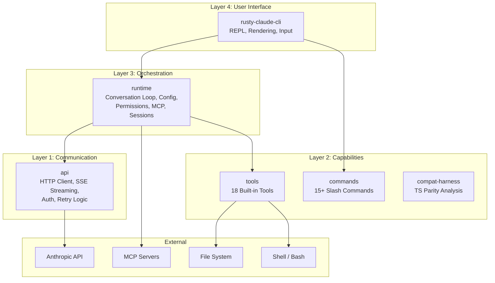
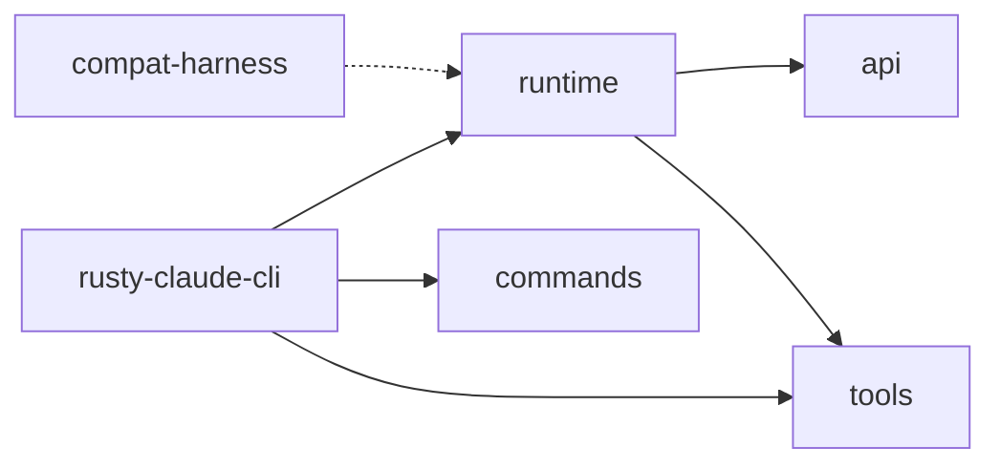
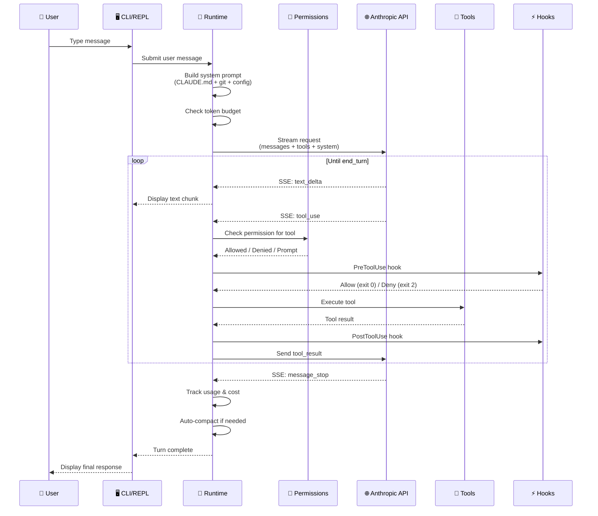
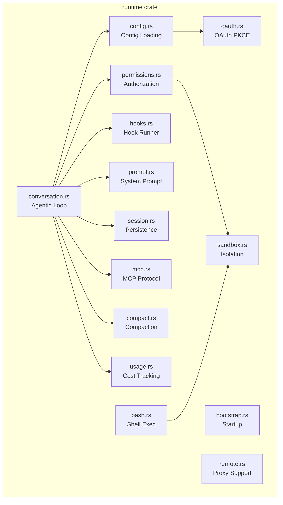

# 🏗️ Architecture Overview

> **The big picture.** How all the pieces of Claude Code fit together.

[← Back to Main](../../README.md)

---

## High-Level Architecture

Claude Code is built as a **modular Rust workspace** with 6 crates, each owning a distinct responsibility. The system follows a layered architecture where the CLI sits on top, the runtime orchestrates everything, and specialized crates handle API communication, tool execution, and command parsing.

---

## Crate Dependency Graph

| Crate | Lines | Purpose |
|-------|-------|---------|
| `api` | ~1,500 | HTTP client, SSE parser, auth, retry |
| `commands` | ~470 | Slash command registry & metadata |
| `compat-harness` | ~200 | TypeScript manifest extraction for parity |
| `runtime` | ~5,300 | **Core** — conversation loop, config, permissions, MCP, sessions |
| `rusty-claude-cli` | ~3,900 | CLI binary, REPL, markdown rendering |
| `tools` | ~4,240 | Built-in tool specifications & execution |

---

## Data Flow: A Single User Turn

This is what happens from the moment you type a message to when you see a response:

---

## Core Design Principles

### 1. Streaming-First
Everything is built around **Server-Sent Events (SSE)**. The API streams tokens incrementally, and the CLI renders them in real-time. No waiting for full responses.

### 2. Permission-by-Default
Every tool declares its required permission level. The runtime enforces this before any execution. Nothing runs without explicit authorization.

### 3. Context-Aware
The system automatically discovers project context — `CLAUDE.md` files, git status, config hierarchies — and injects it into every conversation.

### 4. Composable Tools
Tools are pluggable. Built-in tools handle common operations, MCP servers extend capabilities, and hooks wrap everything with custom logic.

### 5. Memory-Safe
The Rust implementation uses `#![forbid(unsafe_code)]` — zero unsafe blocks. Memory management is handled entirely by Rust's ownership system.

---

## Runtime Component Map

---

## What's Next?

Now that you see the big picture, dive into any specific subsystem:

- **[The Conversation Loop →](../01-conversation-loop/README.md)** — The beating heart of the system
- **[Memory & Compaction →](../02-memory-and-context/README.md)** — How infinite conversations work
- **[Tool System →](../03-tool-system/README.md)** — 18 built-in tools and how they execute

---

[← Back to Main](../../README.md) | [Next: Conversation Loop →](../01-conversation-loop/README.md)
