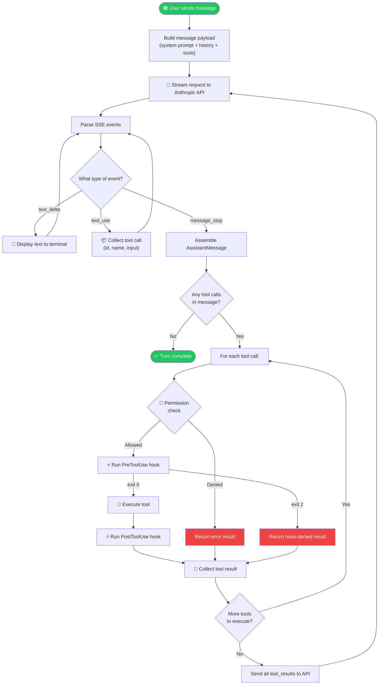
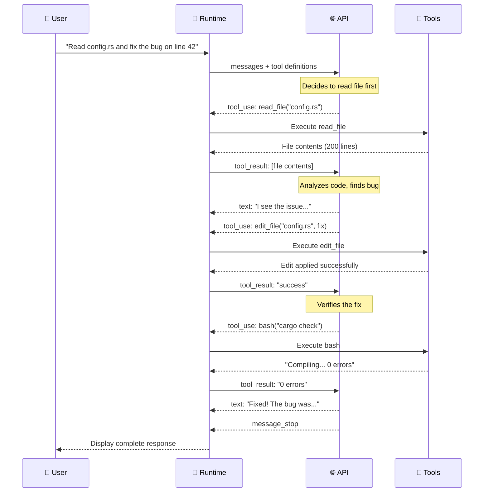
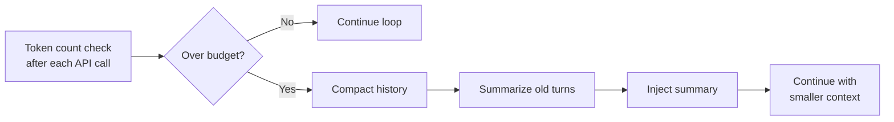
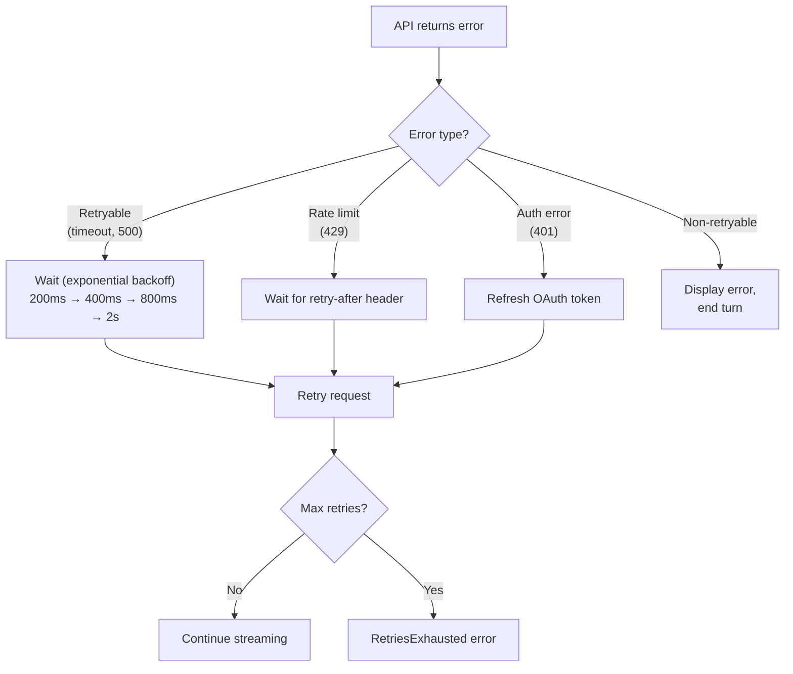

# 🔄 The Agentic Conversation Loop

> **The beating heart.** The core loop that makes Claude Code an *agent*, not just a chatbot.

[← Back to Main](../../README.md) | [← Architecture Overview](../00-architecture-overview/README.md)

---

## What Makes It "Agentic"?

A regular chatbot sends one message and gets one response. An **agentic loop** keeps going — it can call tools, get results, reason about them, call more tools, and iterate until the task is complete. Claude Code's conversation loop is what turns a language model into an autonomous coding assistant.

---

## The Core Loop — Flow Diagram



---

## Sequence Diagram — Multi-Tool Turn

A real-world example: user asks "Read the config file and fix the bug"



---

## Key Data Structures

### Assistant Event — What the API sends

```
┌─────────────────────────────────────────┐
│ Assistant Event Types                   │
├─────────────────────────────────────────┤
│ Text Delta      → Incremental text      │
│ Tool Use        → Tool invocation       │
│                   (id, name, input)      │
│ Usage           → Token count update    │
│ Message Stop    → End of response       │
└─────────────────────────────────────────┘
```

### Turn Summary — What each iteration produces

```
┌─────────────────────────────────────────┐
│ Turn Summary                            │
├─────────────────────────────────────────┤
│ Assistant messages sent                 │
│ Tool results collected                  │
│ Number of iterations                    │
│ Token usage stats                       │
│ Whether auto-compaction triggered       │
└─────────────────────────────────────────┘
```

---

## Stop Conditions

The loop terminates when:

| Condition | What Happens |
|-----------|--------------|
| `stop_reason: "end_turn"` | Model is done — natural completion |
| Max iterations reached | Safety limit to prevent infinite loops |
| Token budget exceeded | Triggers compaction, then continues |
| User cancellation | Ctrl+C interrupts the stream |
| API error (non-retryable) | Error displayed, turn ends |

---

## Auto-Compaction During Loop

When the cumulative input tokens exceed the budget (default 200K), the loop triggers **auto-compaction** mid-conversation:



See **[Memory & Compaction →](../02-memory-and-context/README.md)** for the full deep dive.

---

## Error Recovery in the Loop



---

## What's Next?

- **[Memory & Compaction →](../02-memory-and-context/README.md)** — How the loop handles token limits
- **[Tool System →](../03-tool-system/README.md)** — What happens inside "Execute tool"
- **[Streaming & SSE →](../08-streaming-and-sse/README.md)** — How the SSE parser works

---

[← Architecture Overview](../00-architecture-overview/README.md) | [Next: Memory & Compaction →](../02-memory-and-context/README.md)
