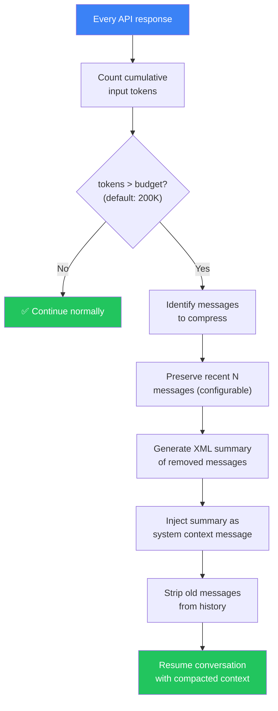
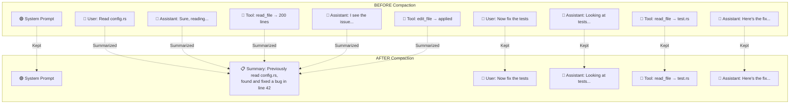
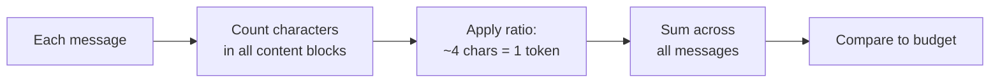
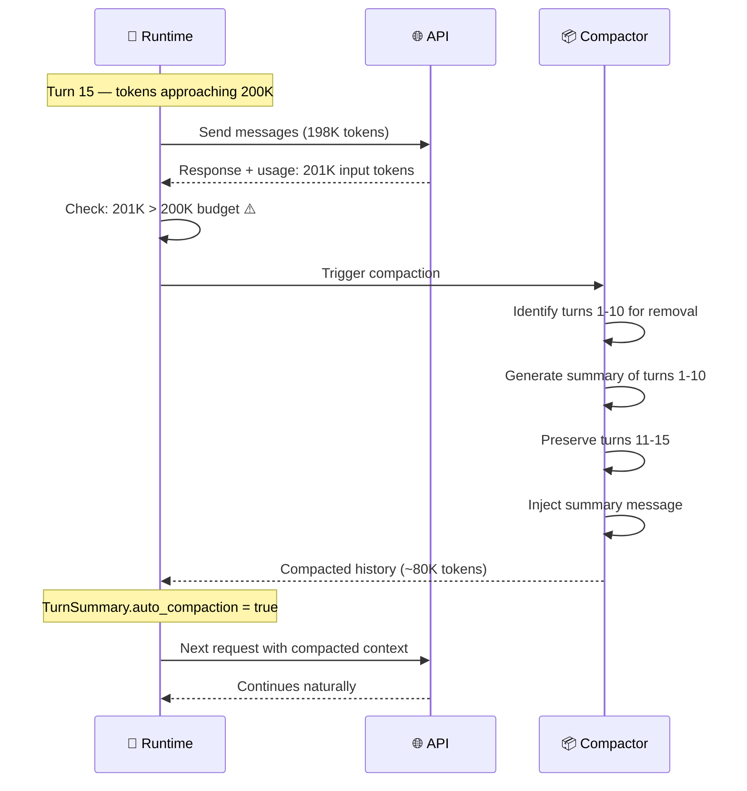
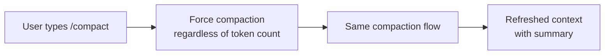

# 🧠 Memory Shrinking & Context Compaction

> **How infinite conversations fit into finite context.** The secret to long-running coding sessions.

[← Back to Main](../../README.md) | [← Conversation Loop](../01-conversation-loop/README.md)

---

## The Problem

Language models have a **fixed context window** (e.g., 200K tokens). But coding sessions can go on for hours — reading files, editing code, running tests, iterating. Without memory management, the conversation would hit the limit and break.

Claude Code solves this with **context compaction** — intelligently shrinking the conversation history while preserving what matters.

---

## How Compaction Works — Full Flow



---

## What Gets Compacted vs. Preserved



---

## Compaction Configuration

```
┌──────────────────────────────────────────────┐
│ CompactionConfig                             │
├──────────────────────────────────────────────┤
│ max_estimated_tokens: u32    (default: 200K) │
│ preserve_recent_messages: u32 (configurable) │
├──────────────────────────────────────────────┤
│ Env override:                                │
│ CLAUDE_CODE_AUTO_COMPACT_INPUT_TOKENS=150000 │
└──────────────────────────────────────────────┘
```

---

## Token Estimation

Before compaction can trigger, the system needs to know how many tokens have been used. Here's how it estimates:



> **Note:** This is an *estimate*. The actual token count from the API (returned in usage) is used for cost tracking, but the estimate is used for compaction decisions to avoid an extra API call.

---

## Summary Generation

When old messages are removed, a **structured summary** replaces them:

```xml
<conversation_summary>
  The user asked to read config.rs and fix a bug.
  The assistant read the file (200 lines), identified an
  off-by-one error on line 42, and applied an edit to fix it.
  The fix was verified with cargo check (0 errors).
</conversation_summary>
```

This summary is injected as a **system-role message** so the model knows what happened before, even though the detailed messages are gone.

---

## Sequence Diagram — Auto-Compaction Mid-Conversation



---

## Manual Compaction: `/compact`

Users can also trigger compaction manually via the `/compact` slash command:



This is useful when:
- The conversation feels "confused" by old context
- You want to start a new subtask within the same session
- You're working on a different part of the codebase

---

## Token Budget Visualization

```
Context Window: 200K tokens
┌─────────────────────────────────────────────────────┐
│ System Prompt          │ ~2K tokens                  │
├────────────────────────┼────────────────────────────│
│ Compacted Summary      │ ~1K tokens (after compact) │
├────────────────────────┼────────────────────────────│
│ Recent Messages        │ ~50K-150K tokens           │
├────────────────────────┼────────────────────────────│
│ Tool Definitions       │ ~5K tokens                  │
├────────────────────────┼────────────────────────────│
│ Available for Response │ Remaining                   │
└────────────────────────┴────────────────────────────┘
```

---

## Key Takeaways

| Aspect | Detail |
|--------|--------|
| **Trigger** | Cumulative input tokens exceed budget (default 200K) |
| **What's removed** | Oldest messages beyond preserve_recent count |
| **What's kept** | System prompt, summary, recent N messages |
| **Summary format** | XML-wrapped natural language summary |
| **Manual trigger** | `/compact` slash command |
| **Config override** | `CLAUDE_CODE_AUTO_COMPACT_INPUT_TOKENS` env var |
| **Impact** | Transparent to user — conversation continues seamlessly |

---

## What's Next?

- **[Tool System →](../03-tool-system/README.md)** — The tools that generate all those tokens
- **[Session Management →](../07-session-management/README.md)** — How conversations persist across restarts

---

[← Conversation Loop](../01-conversation-loop/README.md) | [Next: Tool System →](../03-tool-system/README.md)
