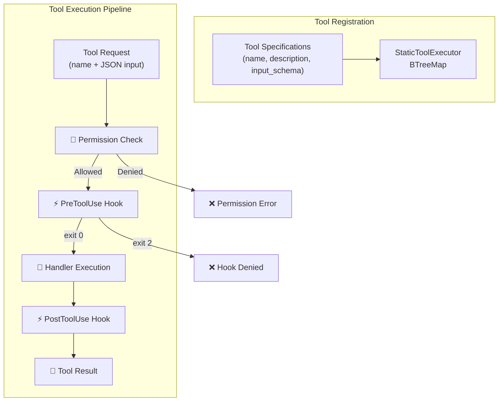
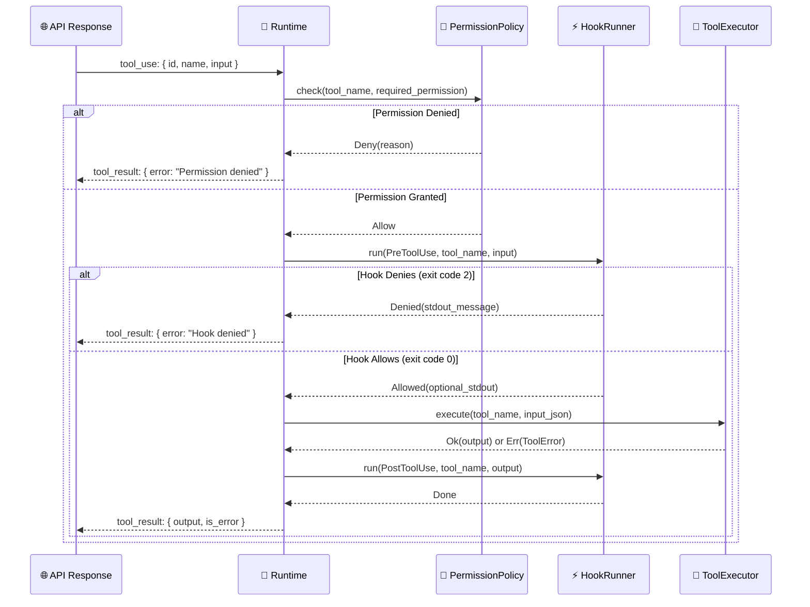
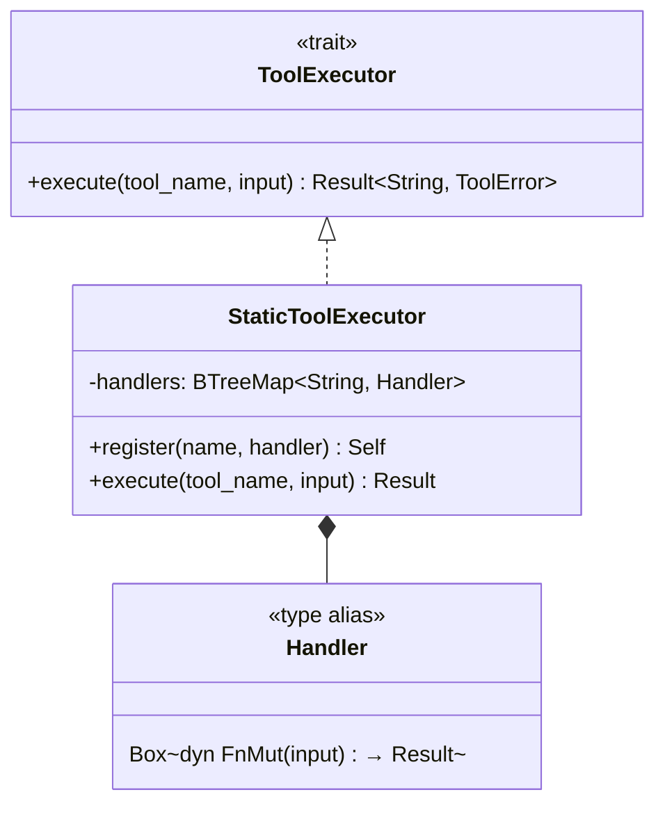
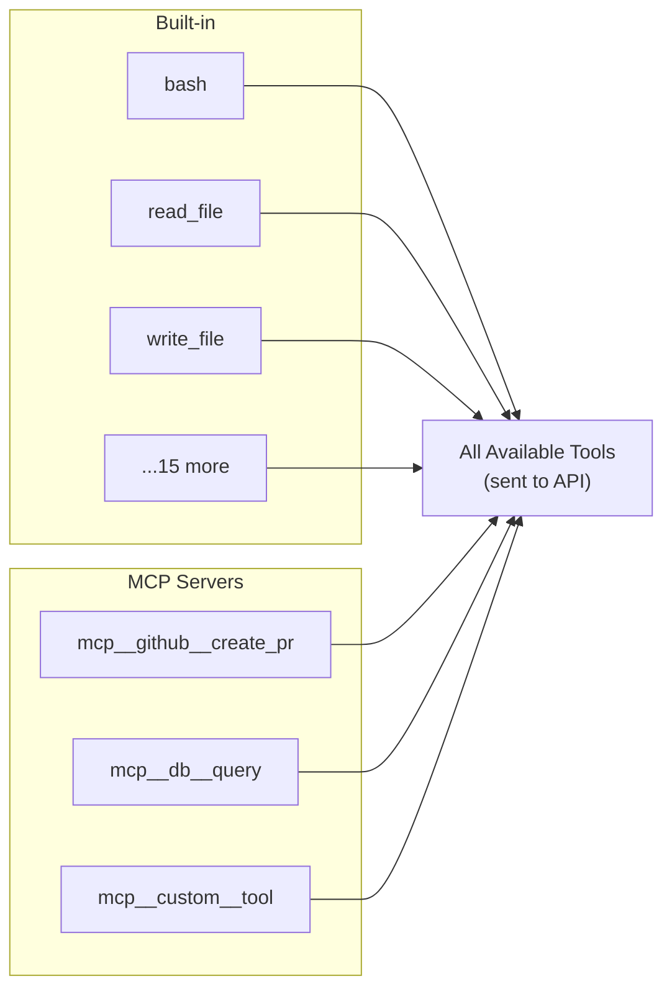
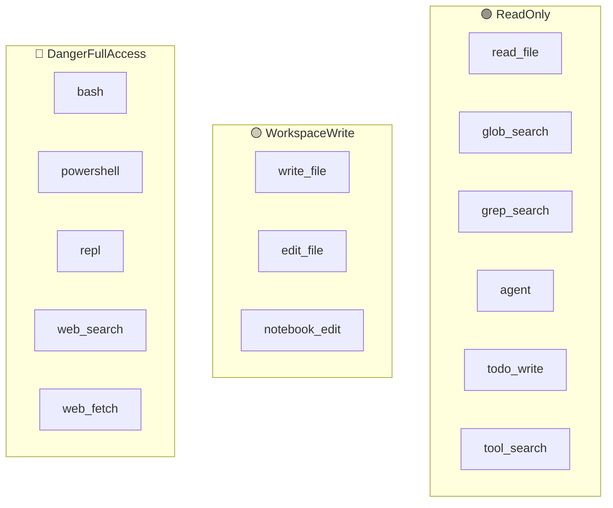

# 🔧 Tool System

> **The hands of the agent.** How Claude Code reads files, writes code, runs commands, and interacts with the world.

[← Back to Main](../../README.md) | [← Memory & Context](../02-memory-and-context/README.md)

---

## Overview

Claude Code isn't just a chatbot — it can *do things*. The tool system is what gives it hands. Every action — reading a file, editing code, running bash — goes through a unified tool execution pipeline.

---

## Tool Architecture



---

## Built-in Tools — Complete Catalog

### File Operations

| Tool | Permission | Description |
|------|-----------|-------------|
| `read_file` | 🟢 ReadOnly | Read file contents with optional line range |
| `write_file` | 🟡 WorkspaceWrite | Create or overwrite files, returns git diff |
| `edit_file` | 🟡 WorkspaceWrite | Apply targeted string replacements |
| `glob_search` | 🟢 ReadOnly | Find files by pattern (e.g., `**/*.rs`) |
| `grep_search` | 🟢 ReadOnly | Search file contents with regex |

### Execution

| Tool | Permission | Description |
|------|-----------|-------------|
| `bash` | 🔴 DangerFullAccess | Run shell commands with timeout and background support |
| `powershell` | 🔴 DangerFullAccess | Windows PowerShell execution |
| `repl` | 🔴 DangerFullAccess | Interactive Python/Node.js REPL |

### Web

| Tool | Permission | Description |
|------|-----------|-------------|
| `web_search` | 🔴 DangerFullAccess | Search the web |
| `web_fetch` | 🔴 DangerFullAccess | Fetch and process URL content |

### Orchestration

| Tool | Permission | Description |
|------|-----------|-------------|
| `agent` | 🟢 ReadOnly | Spawn sub-agent for parallel tasks |
| `skill` | 🟢 ReadOnly | Execute SKILL.md file workflows |
| `todo_write` | 🟢 ReadOnly | Task tracking and management |

### Utility

| Tool | Permission | Description |
|------|-----------|-------------|
| `notebook_edit` | 🟡 WorkspaceWrite | Edit Jupyter notebook cells |
| `tool_search` | 🟢 ReadOnly | Search for available tools |
| `config` | 🟢 ReadOnly | Inspect configuration |

---

## Tool Execution — Sequence Diagram



---

## Tool Input Schema Pattern

Every tool defines its input as a JSON Schema:

```
┌─────────────────────────────────────────────────┐
│ Tool: edit_file                                  │
├─────────────────────────────────────────────────┤
│ Input Schema:                                    │
│ {                                                │
│   "file_path": string    (required)              │
│   "old_string": string   (required)              │
│   "new_string": string   (required)              │
│   "replace_all": boolean (optional, default: false)│
│ }                                                │
├─────────────────────────────────────────────────┤
│ Output: "Edit applied" + git diff                │
│ Error:  "old_string not found" / "not unique"    │
└─────────────────────────────────────────────────┘
```

---

## ToolExecutor — Registration Pattern



### Builder Pattern

```
StaticToolExecutor::new()
    .register("bash", handle_bash)
    .register("read_file", handle_read)
    .register("write_file", handle_write)
    .register("edit_file", handle_edit)
    .register("glob_search", handle_glob)
    .register("grep_search", handle_grep)
    // ... 12 more tools
```

---

## MCP Tools — Dynamic Extension

Beyond built-in tools, Claude Code can load tools from **MCP (Model Context Protocol) servers**:



See **[MCP Integration →](../05-mcp-integration/README.md)** for the full deep dive.

---

## Permission Tiers Per Tool



---

## What's Next?

- **[Permission Model →](../04-permission-model/README.md)** — How the permission checks work
- **[MCP Integration →](../05-mcp-integration/README.md)** — Extending with external tools
- **[Hook System →](../06-hook-system/README.md)** — Wrapping tools with custom logic

---

[← Memory & Context](../02-memory-and-context/README.md) | [Next: Permission Model →](../04-permission-model/README.md)
