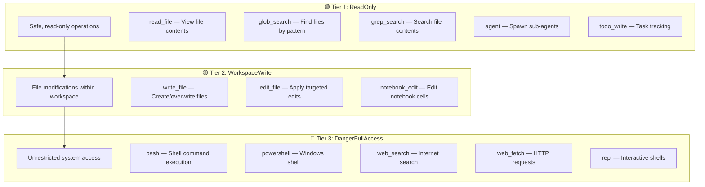
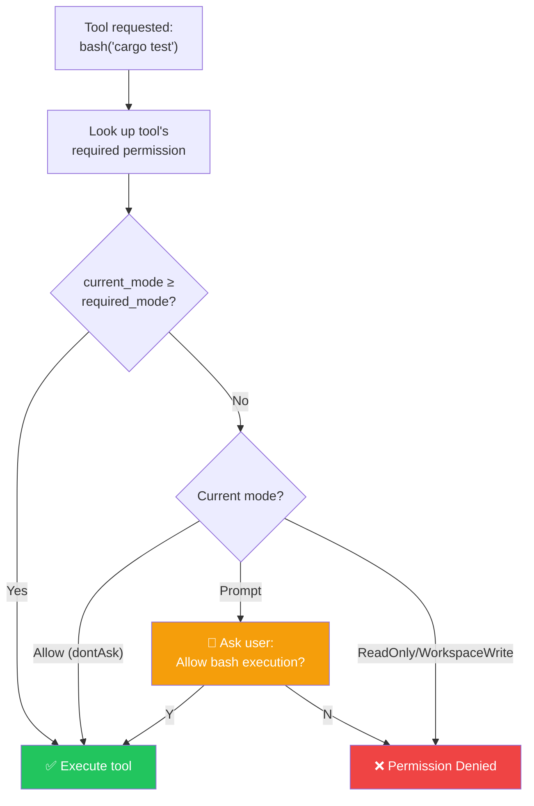
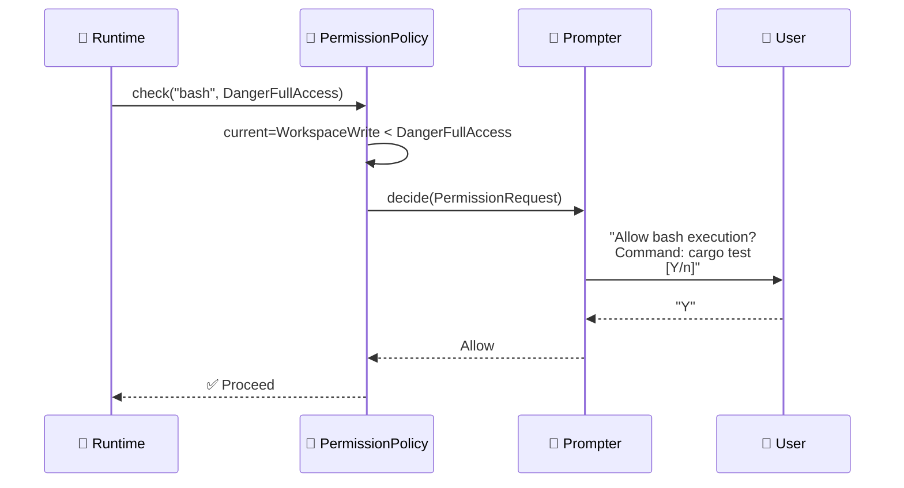
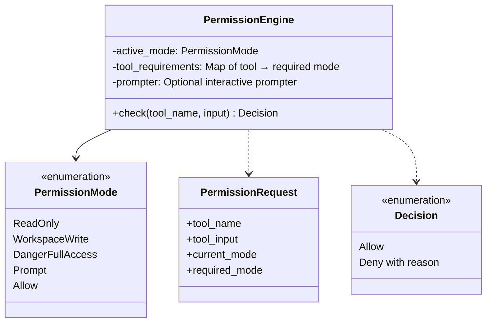
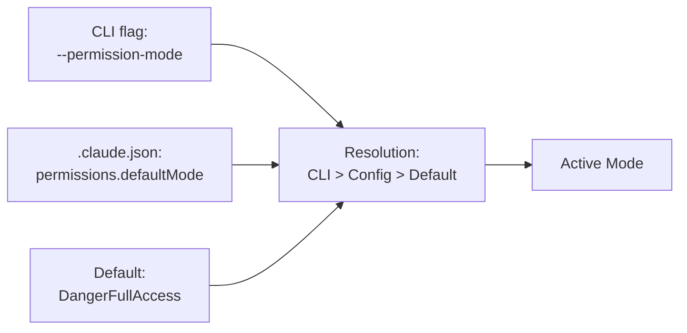

# 🔐 Permission Model

> **Security by design.** How Claude Code controls what the agent can and cannot do.

[← Back to Main](../../README.md) | [← Tool System](../03-tool-system/README.md)

---

## The Problem

An AI agent that can run `bash` commands has the power to `rm -rf /`. The permission model is the guardrail that prevents catastrophic actions while still allowing the agent to be useful.

---

## Three-Tier Permission Hierarchy



---

## Permission Check Flow



---

## Permission Mode Hierarchy

```
┌────────────────────────────────────────────────────┐
│ Mode Ordering (lowest → highest)                   │
├────────────────────────────────────────────────────┤
│                                                    │
│   ReadOnly  <  WorkspaceWrite  <  DangerFullAccess │
│      │              │                    │         │
│   read only      + file writes      + everything  │
│                                                    │
│   Special modes:                                   │
│   • Prompt → Interactively ask user on escalation  │
│   • Allow (dontAsk) → Auto-approve everything      │
│                                                    │
└────────────────────────────────────────────────────┘
```

---

## Interactive Permission Prompting

When mode is `Prompt` and a tool requires escalation:



---

## Permission Engine — Class Diagram



---

## Configuration

Permissions can be set at multiple levels:



### `.claude.json` Example

```json
{
  "permissions": {
    "defaultMode": "dontAsk"
  }
}
```

### CLI Override

```bash
claw --permission-mode read-only
claw --permission-mode workspace-write
claw --permission-mode danger-full-access
```

### Runtime Override

```
> /permissions danger-full-access
Permission mode changed to DangerFullAccess
```

---

## Decision Matrix

| Current Mode | Tool Requires | Result |
|-------------|---------------|--------|
| ReadOnly | ReadOnly | ✅ Allow |
| ReadOnly | WorkspaceWrite | ❌ Deny |
| ReadOnly | DangerFullAccess | ❌ Deny |
| WorkspaceWrite | ReadOnly | ✅ Allow |
| WorkspaceWrite | WorkspaceWrite | ✅ Allow |
| WorkspaceWrite | DangerFullAccess | ❌ Deny |
| DangerFullAccess | Any | ✅ Allow |
| Prompt | Higher than current | 🔔 Ask user |
| Allow (dontAsk) | Any | ✅ Allow |

---

## What's Next?

- **[MCP Integration →](../05-mcp-integration/README.md)** — External tools also go through permissions
- **[Hook System →](../06-hook-system/README.md)** — Hooks can override permission decisions
- **[Sandbox Execution →](../12-sandbox-execution/README.md)** — OS-level isolation beyond permissions

---

[← Tool System](../03-tool-system/README.md) | [Next: MCP Integration →](../05-mcp-integration/README.md)
