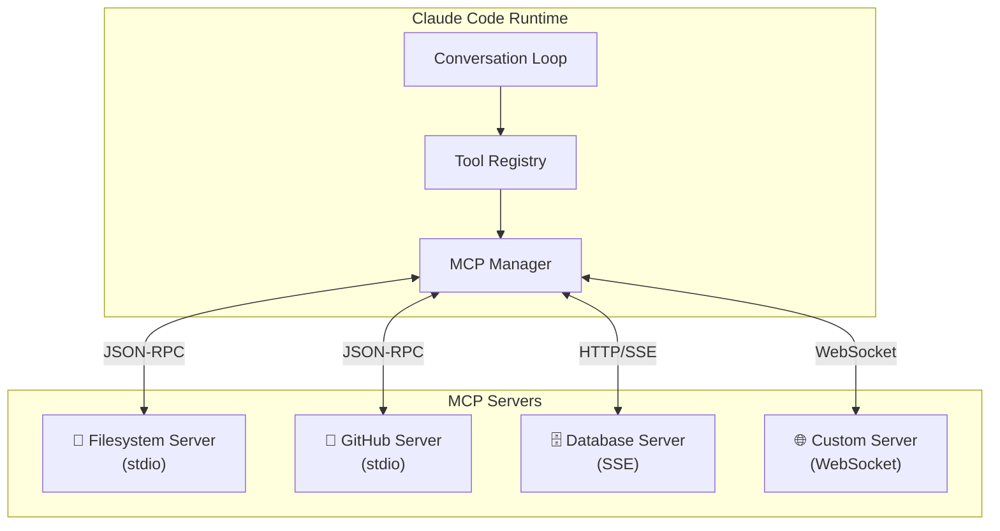
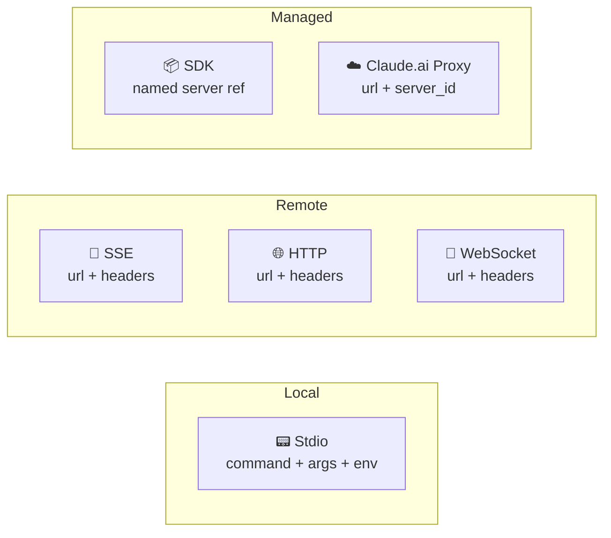
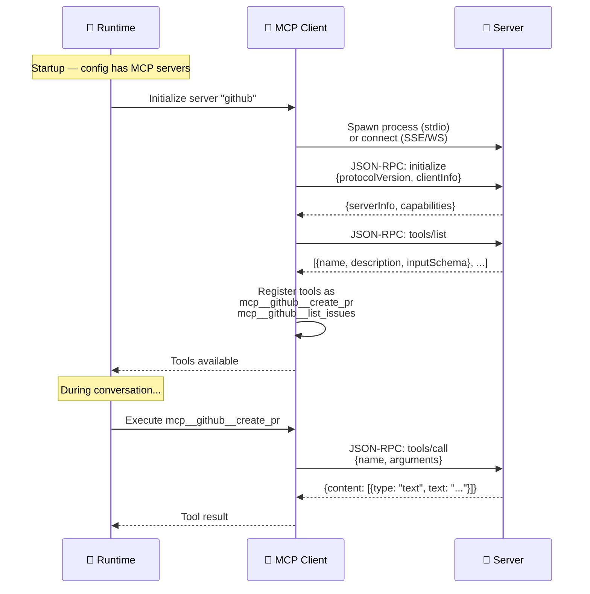
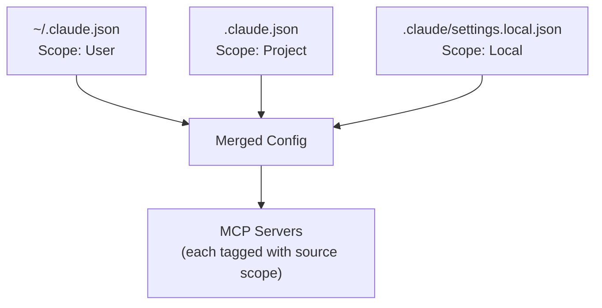
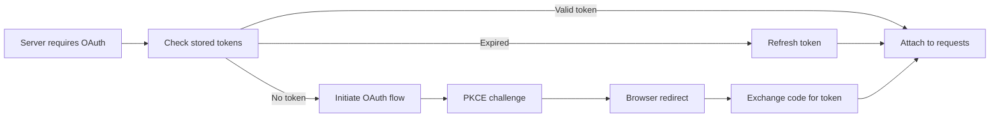

# 🔌 MCP Integration

> **Model Context Protocol.** How Claude Code extends its tool arsenal through external servers.

[← Back to Main](../../README.md) | [← Permission Model](../04-permission-model/README.md)

---

## What Is MCP?

**Model Context Protocol (MCP)** is a standard for connecting AI models to external tools and data sources. Instead of hardcoding every tool, Claude Code can dynamically discover and use tools from MCP servers — turning it into an infinitely extensible agent.

---

## MCP Architecture



---

## Six Transport Types



| Transport | Use Case | Config |
|-----------|----------|--------|
| **Stdio** | Local CLI tools | `command`, `args`, `env` |
| **SSE** | Remote servers (streaming) | `url`, `headers` |
| **HTTP** | Remote servers (request/response) | `url`, `headers` |
| **WebSocket** | Bidirectional real-time | `url`, `headers` |
| **SDK** | Pre-built integrations | `name` reference |
| **Claude.ai Proxy** | Authenticated tunneling | `url`, `server_id` |

---

## Server Lifecycle



---

## Tool Naming Convention

MCP tools follow a strict naming pattern:

```
mcp__{server_name}__{tool_name}

Examples:
  mcp__github__create_pr
  mcp__database__query
  mcp__filesystem__read_dir
```

**Name normalization:** Non-alphanumeric characters → underscores

```
Server: "my-github-server" → "my_github_server"
Tool:   "create.pull-request" → "create_pull_request"
Result: "mcp__my_github_server__create_pull_request"
```

---

## Configuration

MCP servers are configured in `.claude.json` or `.claude/settings.json`:

```json
{
  "mcpServers": {
    "github": {
      "type": "stdio",
      "command": "npx",
      "args": ["-y", "@modelcontextprotocol/server-github"],
      "env": {
        "GITHUB_TOKEN": "ghp_..."
      }
    },
    "database": {
      "type": "sse",
      "url": "https://my-server.com/mcp",
      "headers": {
        "Authorization": "Bearer token123"
      }
    }
  }
}
```

---

## Config Scoping



Each server inherits the **scope** of its config source. This determines:
- Which permission policies apply
- Whether the server is shared across projects
- Whether it appears in project exports

---

## OAuth for MCP Servers

Some MCP servers require OAuth authentication:



Config:
```json
{
  "mcpServers": {
    "secure-server": {
      "type": "sse",
      "url": "https://server.com/mcp",
      "oauth": {
        "client_id": "abc123",
        "callback_port": 8080,
        "auth_server_metadata_url": "https://auth.server.com/.well-known/oauth"
      }
    }
  }
}
```

---

## MCP Bootstrap Data

```
┌────────────────────────────────────────────────┐
│ McpClientBootstrap                             │
├────────────────────────────────────────────────┤
│ normalized_name: String  ("my_github_server")  │
│ tool_prefix: String      ("mcp__my_github_..") │
│ signature: String        (hash for dedup)      │
│ transport: TransportType (Stdio/SSE/WS/...)    │
│ scope: ConfigSource      (User/Project/Local)  │
└────────────────────────────────────────────────┘
```

---

## What's Next?

- **[Hook System →](../06-hook-system/README.md)** — Hooks work with MCP tools too
- **[Configuration →](../09-config-system/README.md)** — How MCP config is loaded and merged
- **[Authentication →](../10-authentication/README.md)** — OAuth details for MCP servers

---

[← Permission Model](../04-permission-model/README.md) | [Next: Hook System →](../06-hook-system/README.md)
