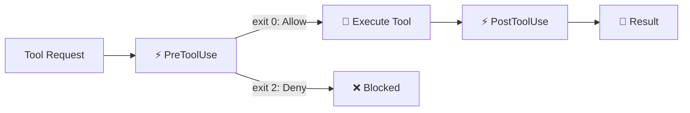
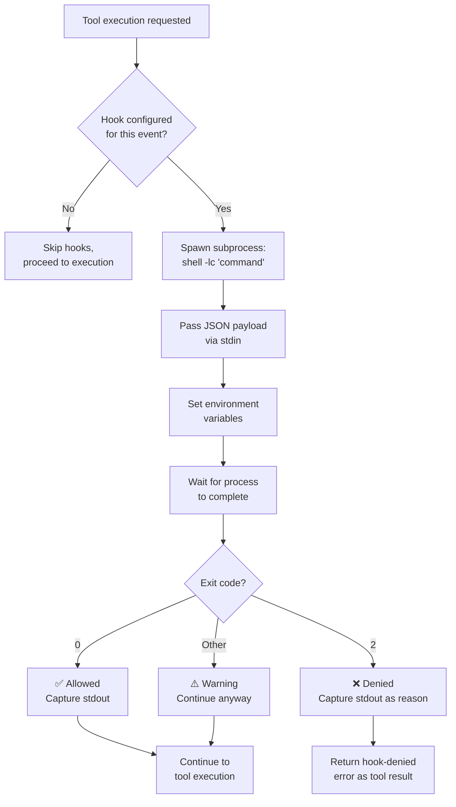
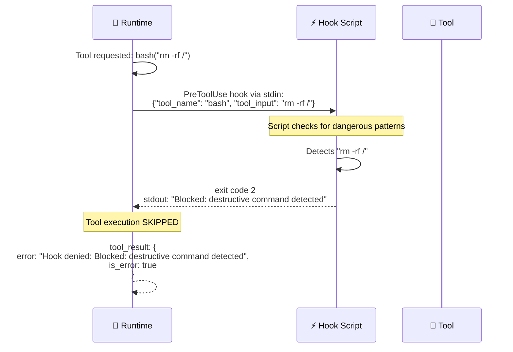
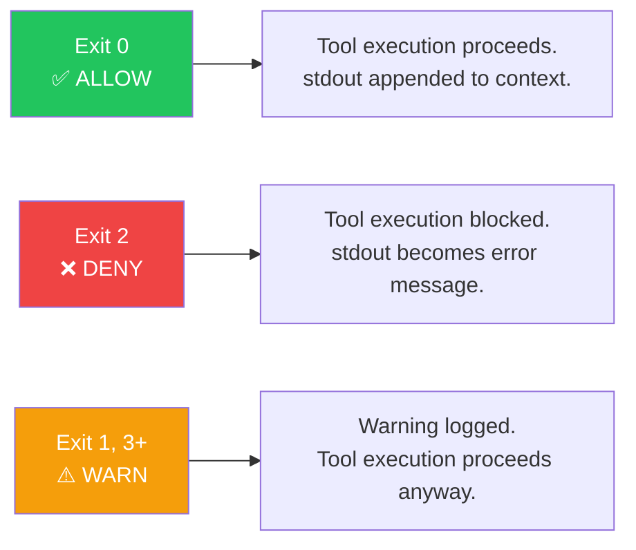

# ⚡ Hook System

> **Intercept everything.** Run custom logic before and after every tool execution.

[← Back to Main](../../README.md) | [← MCP Integration](../05-mcp-integration/README.md)

---

## What Are Hooks?

Hooks are shell commands that run at tool execution boundaries. They give you the power to:
- **Block dangerous operations** before they execute
- **Log every tool call** for auditing
- **Transform inputs or outputs** programmatically
- **Enforce custom policies** beyond the built-in permission model

---

## Hook Events



| Event | When | Can Block? |
|-------|------|-----------|
| `PreToolUse` | Before tool execution | ✅ Yes (exit code 2) |
| `PostToolUse` | After tool completion | ❌ No (informational) |

---

## Hook Execution Flow — Detailed



---

## Hook Payload — What Your Script Receives

### stdin (JSON)

```json
{
  "hook_event_name": "PreToolUse",
  "tool_name": "bash",
  "tool_input": "rm -rf /tmp/test",
  "tool_input_json": "{\"command\": \"rm -rf /tmp/test\"}"
}
```

For `PostToolUse`, additional fields:
```json
{
  "hook_event_name": "PostToolUse",
  "tool_name": "bash",
  "tool_input": "cargo test",
  "tool_output": "test result: ok. 5 passed",
  "tool_result_is_error": false
}
```

### Environment Variables

| Variable | Description |
|----------|-------------|
| `HOOK_EVENT` | `PreToolUse` or `PostToolUse` |
| `HOOK_TOOL_NAME` | Name of the tool being called |
| `HOOK_TOOL_INPUT` | Raw input string |
| `HOOK_TOOL_IS_ERROR` | `"true"` or `"false"` (post-hook only) |
| `HOOK_TOOL_OUTPUT` | Tool output (post-hook only) |

---

## Sequence Diagram — Hook Blocking a Dangerous Command



---

## Exit Code Semantics



---

## Configuration

Hooks are defined in `.claude.json` or `.claude/settings.json`:

```json
{
  "hooks": {
    "PreToolUse": [
      {
        "command": "python3 /path/to/safety-check.py"
      }
    ],
    "PostToolUse": [
      {
        "command": "bash /path/to/audit-log.sh"
      }
    ]
  }
}
```

---

## Example Hook Scripts

### Safety Guard (PreToolUse)

```bash
#!/bin/bash
# Block dangerous bash commands
read -r payload
tool=$(echo "$payload" | jq -r '.tool_name')
input=$(echo "$payload" | jq -r '.tool_input')

if [[ "$tool" == "bash" ]]; then
    if echo "$input" | grep -qE "rm -rf|DROP TABLE|format c:"; then
        echo "Blocked: Dangerous command pattern detected"
        exit 2
    fi
fi
exit 0
```

### Audit Logger (PostToolUse)

```bash
#!/bin/bash
# Log all tool executions
read -r payload
echo "$(date -u +%FT%TZ) $payload" >> ~/.claude/audit.log
exit 0
```

---

## What's Next?

- **[Session Management →](../07-session-management/README.md)** — Persisting conversations
- **[Config System →](../09-config-system/README.md)** — Where hooks are configured
- **[Permission Model →](../04-permission-model/README.md)** — Hooks complement permissions

---

[← MCP Integration](../05-mcp-integration/README.md) | [Next: Session Management →](../07-session-management/README.md)
