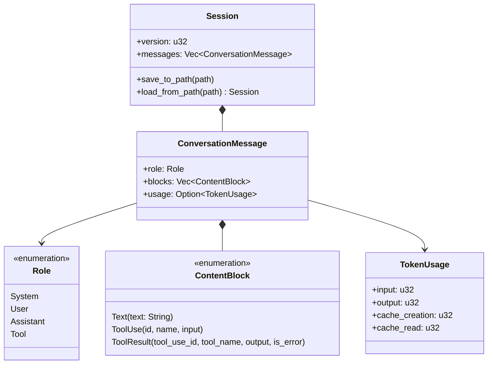
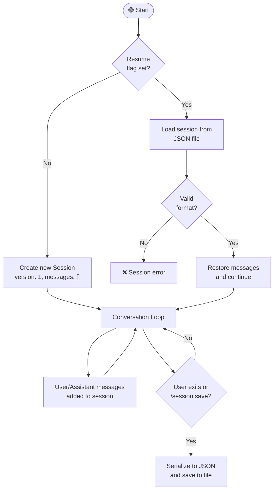
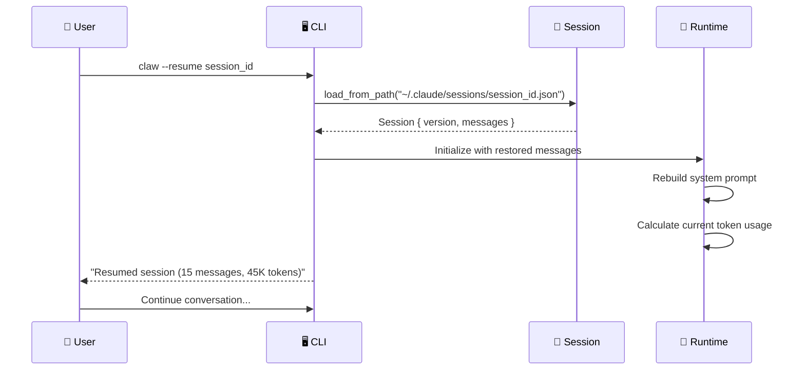

# 💾 Session Management

> **Pick up where you left off.** How Claude Code persists and resumes conversations.

[← Back to Main](../../README.md) | [← Hook System](../06-hook-system/README.md)

---

## Why Sessions Matter

Coding tasks often span multiple sittings. You might start debugging in the morning, close your terminal, and want to continue in the afternoon. Sessions make this seamless — every message, tool result, and usage stat is persisted.

---

## Session Data Model



---

## Session Lifecycle



---

## JSON Serialization Format

Sessions are stored as JSON files with deterministic key ordering (BTreeMap):

```json
{
  "version": 1,
  "messages": [
    {
      "role": "user",
      "blocks": [
        {
          "type": "text",
          "text": "Read the config file"
        }
      ]
    },
    {
      "role": "assistant",
      "blocks": [
        {
          "type": "text",
          "text": "I'll read config.rs for you."
        },
        {
          "type": "tool_use",
          "id": "tool_abc123",
          "name": "read_file",
          "input": "{\"file_path\": \"config.rs\"}"
        }
      ],
      "usage": {
        "input": 1520,
        "output": 340,
        "cache_creation": 0,
        "cache_read": 150
      }
    },
    {
      "role": "tool",
      "blocks": [
        {
          "type": "tool_result",
          "tool_use_id": "tool_abc123",
          "tool_name": "read_file",
          "output": "fn main() { ... }",
          "is_error": false
        }
      ]
    }
  ]
}
```

---

## Resume Flow — Sequence Diagram



---

## Session Commands

```
/session          — Show current session info
/session save     — Save session to file
/resume <id>      — Resume a saved session
/export           — Export session (JSON/text)
```

---

## What's Next?

- **[Streaming & SSE →](../08-streaming-and-sse/README.md)** — How messages stream in real-time
- **[Memory & Context →](../02-memory-and-context/README.md)** — How old sessions get compacted

---

[← Hook System](../06-hook-system/README.md) | [Next: Streaming & SSE →](../08-streaming-and-sse/README.md)
