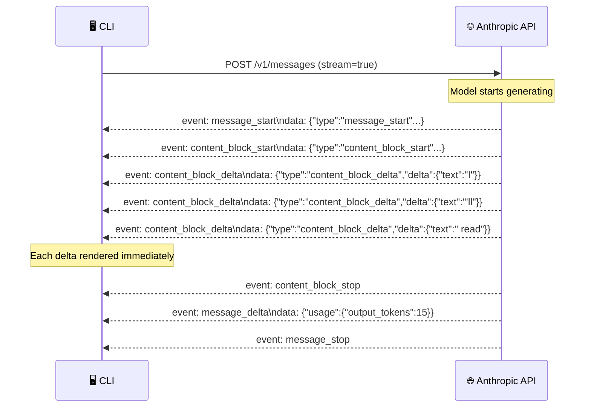
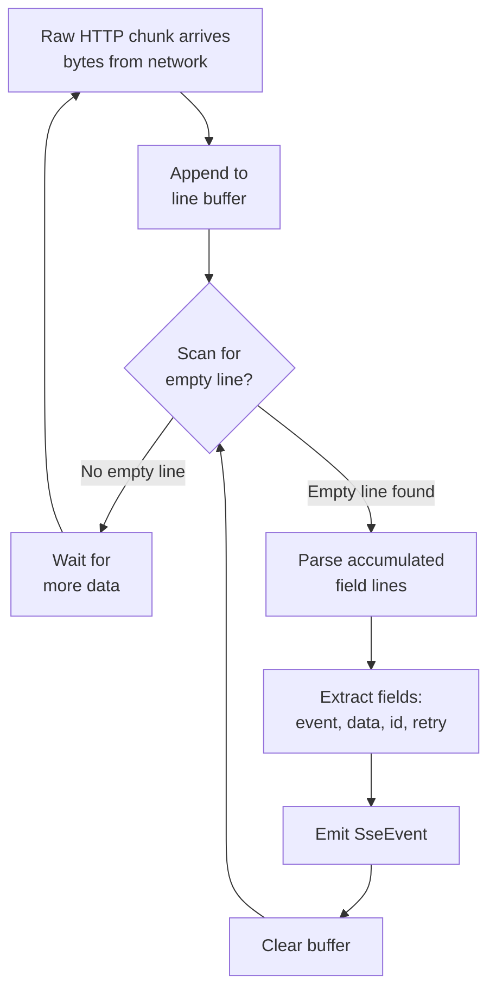
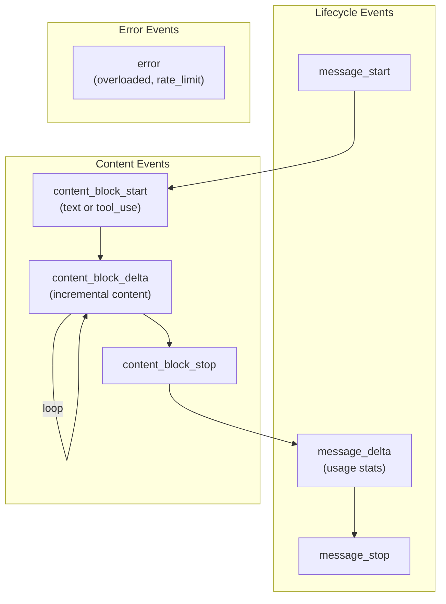
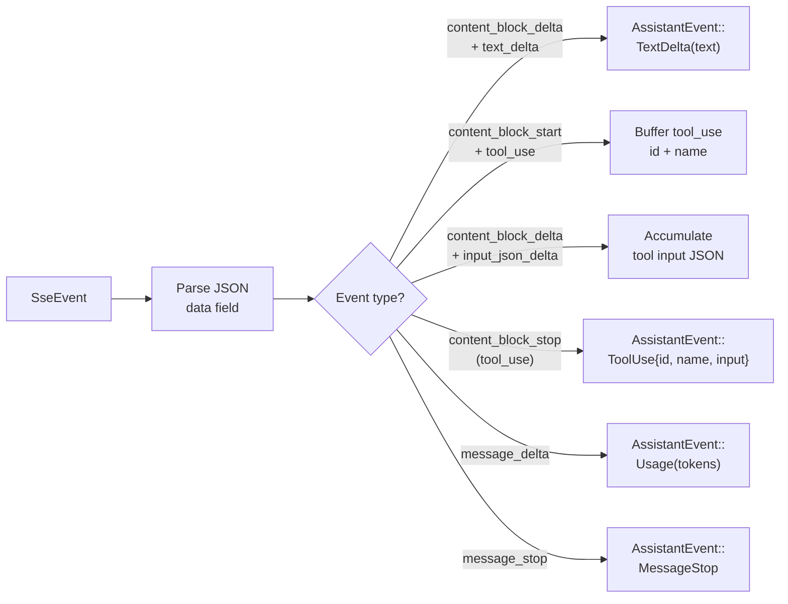
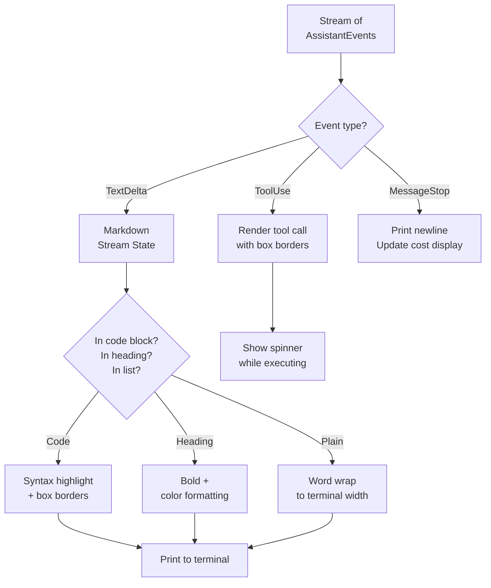
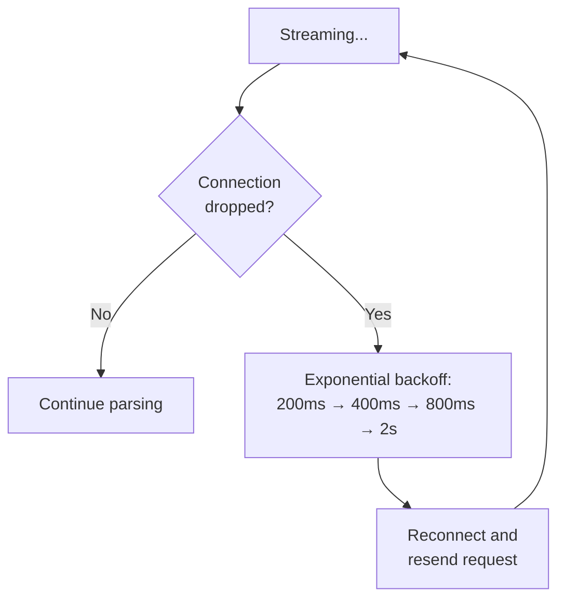

# 📡 Streaming & SSE Parsing

> **Real-time token delivery.** How Claude Code parses Server-Sent Events for live streaming output.

[← Back to Main](../../README.md) | [← Session Management](../07-session-management/README.md)

---

## Why Streaming?

Without streaming, you'd wait 10-30 seconds staring at a blank screen while the model generates its full response. With **Server-Sent Events (SSE)**, tokens arrive one-by-one as they're generated — giving instant feedback and a responsive terminal experience.

---

## SSE Protocol — How It Works



---

## IncrementalSseParser — The Parser



---

## SSE Event Structure

```
┌──────────────────────────────────────┐
│ SseEvent                             │
├──────────────────────────────────────┤
│ event: Option<String>  (event name)  │
│ data: String           (JSON payload)│
│ id: Option<String>     (event ID)    │
│ retry: Option<u64>     (retry ms)    │
└──────────────────────────────────────┘
```

### Raw SSE Wire Format

```
event: content_block_delta
data: {"type":"content_block_delta","index":0,"delta":{"type":"text_delta","text":"Hello"}}

event: content_block_delta
data: {"type":"content_block_delta","index":0,"delta":{"type":"text_delta","text":" world"}}

event: message_stop
data: {"type":"message_stop"}
```

Key rules:
- Lines starting with `event:` set the event name
- Lines starting with `data:` append to data (multi-line concatenation)
- An **empty line** signals the end of an event
- Lines starting with `:` are comments (heartbeat keep-alives)

---

## Event Types from Anthropic API



---

## Stream → AssistantEvent Mapping



---

## Terminal Rendering Pipeline



---

## Retry on Stream Failure



---

## What's Next?

- **[Config System →](../09-config-system/README.md)** — API configuration and model selection
- **[Error Handling →](../15-error-handling-and-retry/README.md)** — Retry logic deep dive

---

[← Session Management](../07-session-management/README.md) | [Next: Config System →](../09-config-system/README.md)
