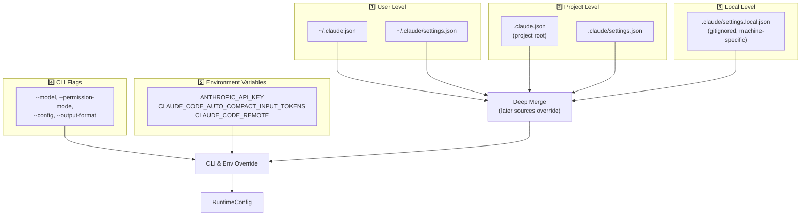
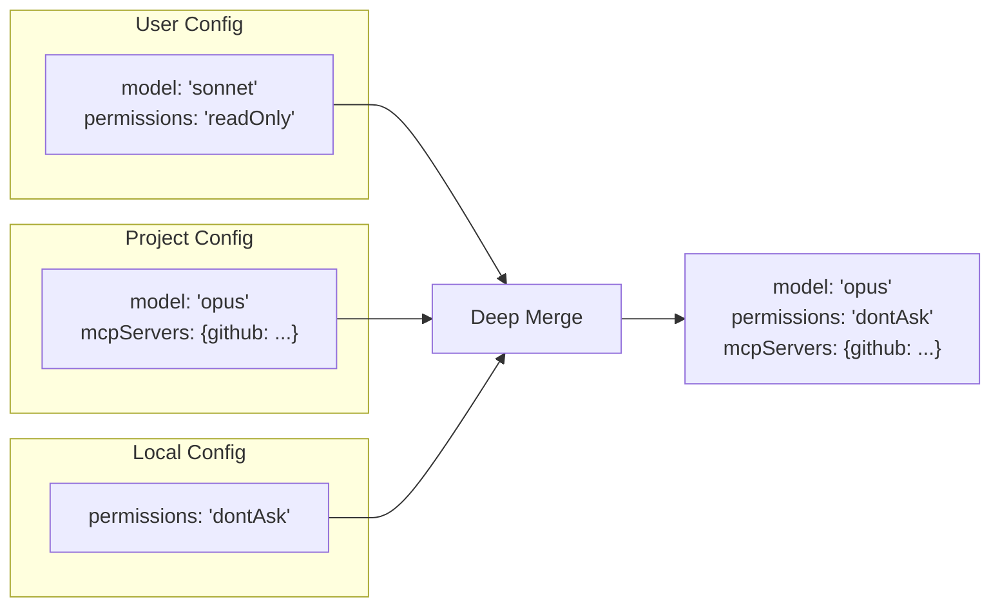
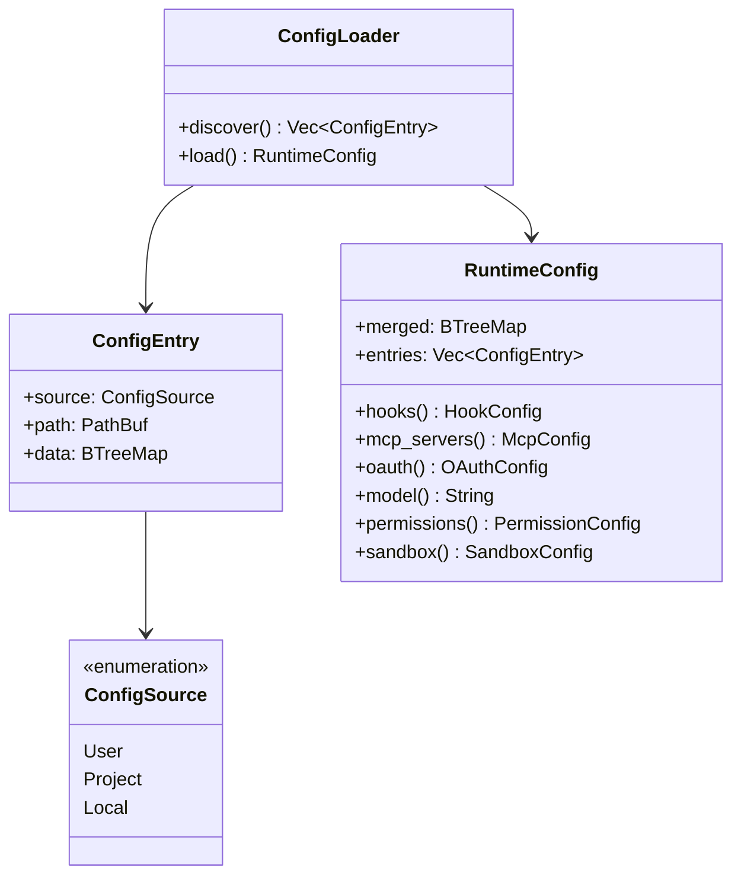
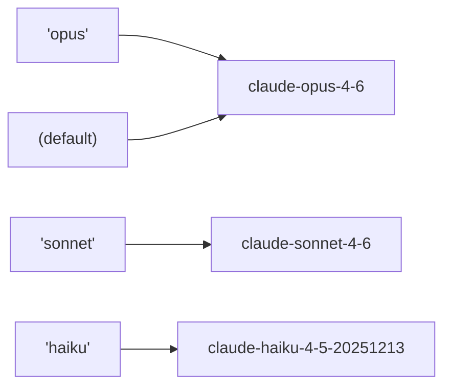

# ⚙️ Configuration System

> **Five sources, one config.** How Claude Code discovers, loads, and merges settings from everywhere.

[← Back to Main](../../README.md) | [← Streaming & SSE](../08-streaming-and-sse/README.md)

---

## The Challenge

Configuration can come from 5+ different files, CLI flags, and environment variables. The config system resolves them all into a single, merged runtime config.

---

## Config Discovery Chain



---

## Merge Strategy



**Rules:**
- Later sources override earlier ones for scalar values
- Objects (like `mcpServers`) are deep-merged
- Arrays are replaced, not concatenated
- CLI flags always win

---

## ConfigSource Scoping



---

## Feature Extraction

The RuntimeConfig provides typed accessors for each feature:

```
┌───────────────────────────────────────────────────┐
│ RuntimeConfig                                     │
├───────────────────────────────────────────────────┤
│ .hooks()         → RuntimeHookConfig              │
│ .mcp_servers()   → HashMap<String, McpServerConfig>│
│ .oauth()         → OAuthConfig                    │
│ .model()         → String (e.g., "claude-opus-4-6")│
│ .permissions()   → PermissionConfig               │
│ .sandbox()       → SandboxConfig                  │
└───────────────────────────────────────────────────┘
```

---

## Model Aliases



---

## Config File Examples

### Minimal `.claude.json`
```json
{
  "permissions": {
    "defaultMode": "dontAsk"
  }
}
```

### Full-Featured `.claude.json`
```json
{
  "model": "opus",
  "permissions": {
    "defaultMode": "workspaceWrite"
  },
  "hooks": {
    "PreToolUse": [
      { "command": "python3 safety-check.py" }
    ]
  },
  "mcpServers": {
    "github": {
      "type": "stdio",
      "command": "npx",
      "args": ["-y", "@modelcontextprotocol/server-github"]
    }
  },
  "sandbox": {
    "enabled": true,
    "filesystem_mode": "WorkspaceOnly"
  }
}
```

---

## What's Next?

- **[Authentication →](../10-authentication/README.md)** — OAuth and API key configuration
- **[Permission Model →](../04-permission-model/README.md)** — Permission config in detail

---

[← Streaming & SSE](../08-streaming-and-sse/README.md) | [Next: Authentication →](../10-authentication/README.md)
