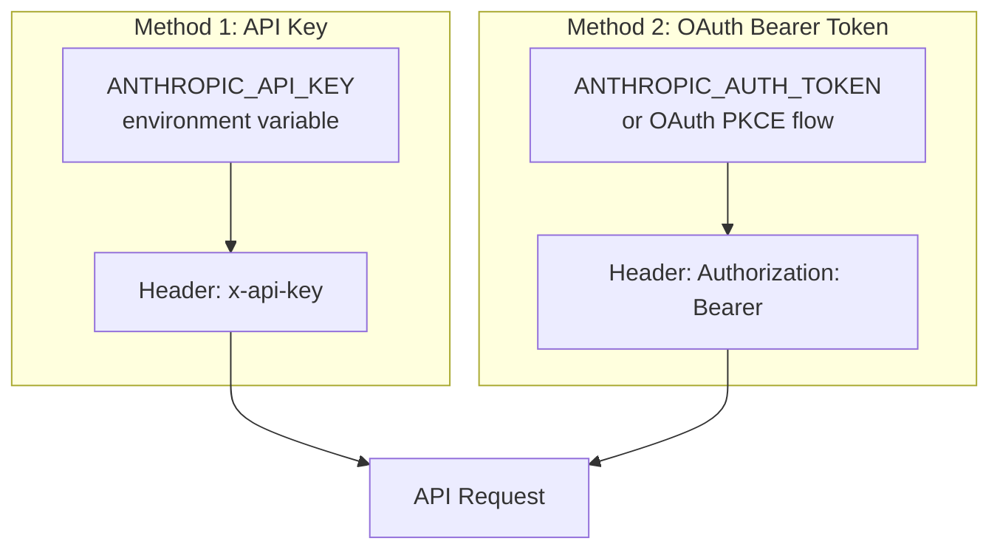
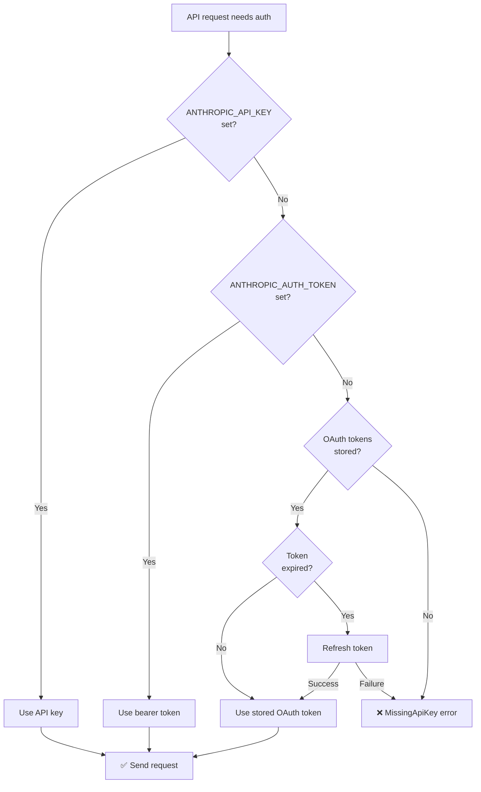
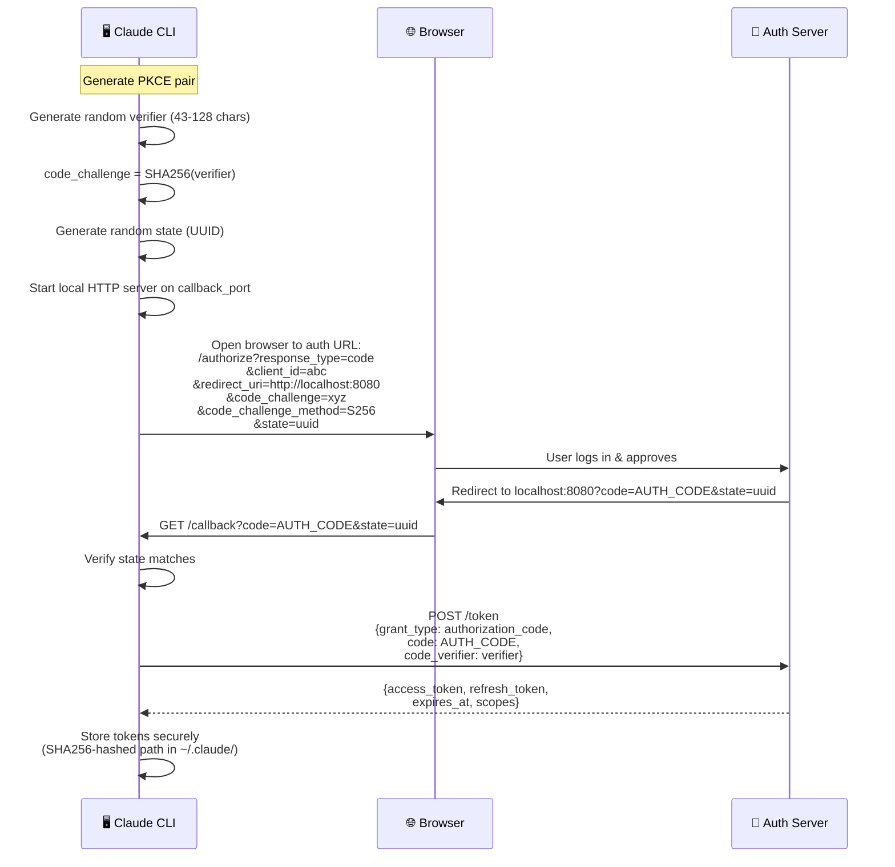
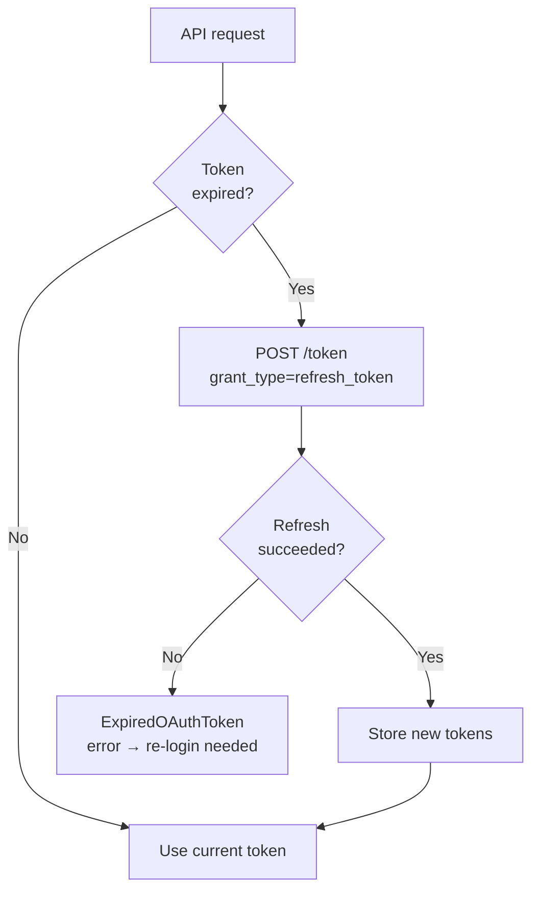

# 🔑 Authentication

> **Two paths to the API.** API keys for simplicity, OAuth PKCE for security.

[← Back to Main](../../README.md) | [← Config System](../09-config-system/README.md)

---

## Authentication Methods

Claude Code supports two authentication methods that can be used independently or together:



---

## Auth Resolution Chain



---

## OAuth PKCE Flow

PKCE (Proof Key for Code Exchange) is the secure OAuth flow for CLI applications:



---

## Token Storage

```
┌──────────────────────────────────────────┐
│ Token Set                                │
├──────────────────────────────────────────┤
│ Access Token                             │
│ Refresh Token (optional)                 │
│ Expiration Time (optional)               │
│ Granted Scopes                           │
├──────────────────────────────────────────┤
│ Storage: ~/.claude/credentials/<hash>    │
│ Hash: SHA256 of client config            │
│ File permissions: owner read/write only  │
└──────────────────────────────────────────┘
```

---

## Token Refresh — Automatic



---

## Security Features

| Feature | Implementation |
|---------|---------------|
| **PKCE** | S256 challenge prevents authorization code interception |
| **State parameter** | UUID prevents CSRF attacks |
| **Secure storage** | SHA256-hashed file paths, 0600 permissions |
| **Token masking** | Sensitive tokens redacted in debug/log output |
| **Loopback redirect** | localhost-only callback (no external server needed) |
| **Automatic refresh** | Expired tokens refreshed transparently |

---

## What's Next?

- **[CLI & REPL →](../11-cli-and-repl/README.md)** — Where auth commands live (`/login`, `/logout`)
- **[Config System →](../09-config-system/README.md)** — Where API keys are configured

---

[← Config System](../09-config-system/README.md) | [Next: CLI & REPL →](../11-cli-and-repl/README.md)
