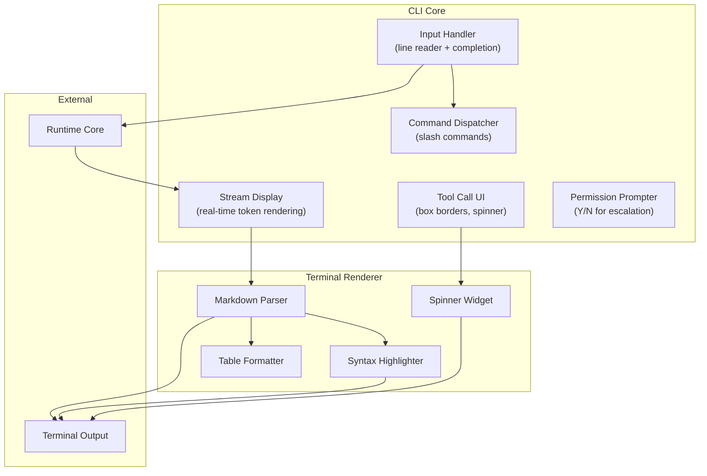
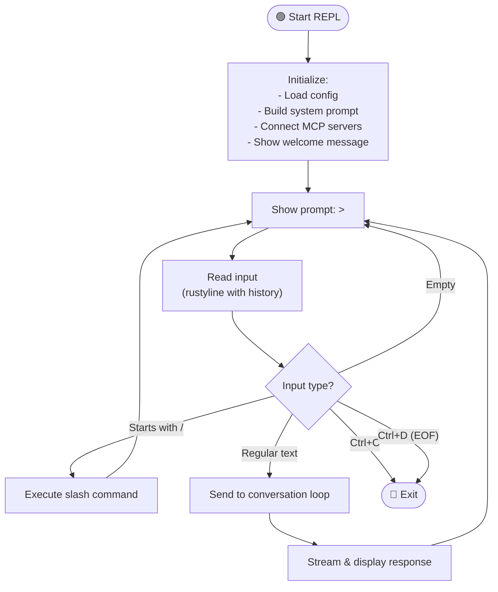
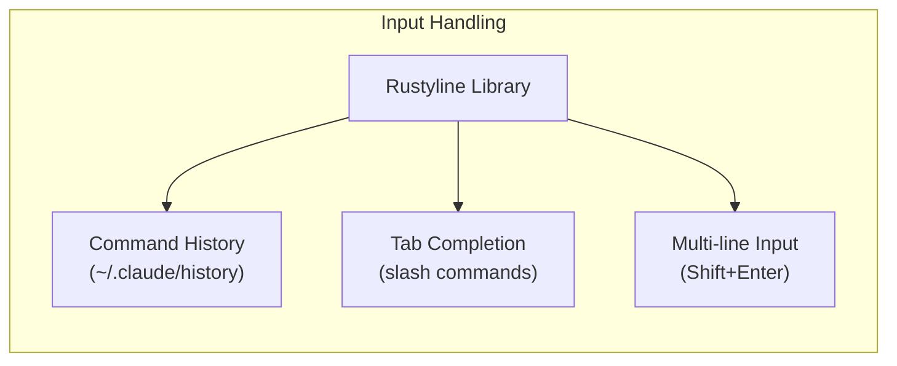
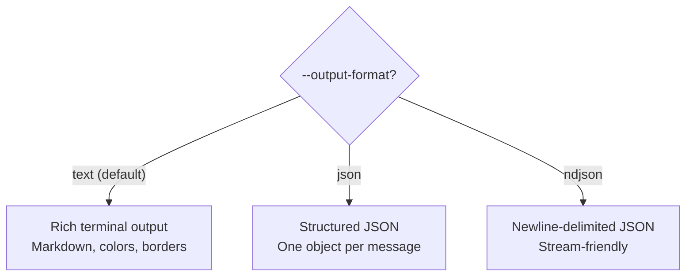

# 🖥️ CLI & REPL

> **The terminal experience.** How Claude Code renders markdown, handles input, and creates a polished developer UX.

[← Back to Main](../../README.md) | [← Authentication](../10-authentication/README.md)

---

## CLI Architecture



---

## REPL Loop



---

## Input Features



| Feature | How |
|---------|-----|
| **History** | Up/Down arrows cycle through previous inputs |
| **Completion** | Tab completes slash commands (`/com` → `/compact`) |
| **Multi-line** | Shift+Enter adds a newline without submitting |
| **Editing** | Emacs-style keybindings (Ctrl+A, Ctrl+E, etc.) |

---

## Markdown Rendering Pipeline

```mermaid
flowchart TD
    INPUT["Streaming text<br/>from assistant"] --> STATE["MarkdownStreamState"]

    STATE --> DETECT{"Detect block type"}

    DETECT -->|"```language"| CODE["Code Block"]
    CODE --> SYNTAX["Apply syntax highlighting<br/>(language-aware)"]
    SYNTAX --> BOX["Draw box borders<br/>┌──────────┐<br/>│ code     │<br/>└──────────┘"]

    DETECT -->|"# Heading"| HEADING["Bold + Color"]

    DETECT -->|"- item"| LIST["Bullet formatting"]

    DETECT -->|"|col|col|"| TABLE["Table alignment<br/>& borders"]

    DETECT -->|"Regular text"| WRAP["Word wrap to<br/>terminal width"]

    BOX --> OUTPUT["Terminal Output"]
    HEADING --> OUTPUT
    LIST --> OUTPUT
    TABLE --> OUTPUT
    WRAP --> OUTPUT
```

---

## Tool Call Rendering

When the assistant calls a tool, it's displayed with clear visual boundaries:

```
╭─────────────────────────────────────────╮
│ 🔧 read_file                            │
│ file_path: "src/main.rs"                │
╰─────────────────────────────────────────╯
  ⠋ Reading file...

╭─ Result ────────────────────────────────╮
│ fn main() {                              │
│     println!("Hello, world!");           │
│ }                                        │
╰─────────────────────────────────────────╯
```

---

## Output Formats



---

## CLI Arguments

```
claw [OPTIONS] [PROMPT]

Options:
  --model <MODEL>              Model to use (opus/sonnet/haiku)
  --permission-mode <MODE>     ReadOnly/WorkspaceWrite/DangerFullAccess
  --config <PATH>              Custom config file
  --output-format <FORMAT>     text/json/ndjson
  --resume <SESSION_ID>        Resume a saved session

Subcommands:
  init          Initialize project configuration
  login         Authenticate via OAuth
  logout        Clear stored credentials
```

---

## What's Next?

- **[Sandbox Execution →](../12-sandbox-execution/README.md)** — How bash commands are isolated
- **[Slash Commands →](../14-slash-commands/README.md)** — The full command registry

---

[← Authentication](../10-authentication/README.md) | [Next: Sandbox Execution →](../12-sandbox-execution/README.md)
