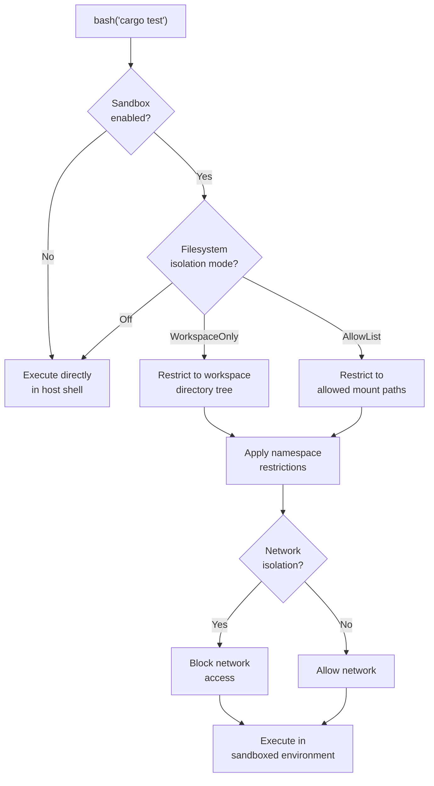
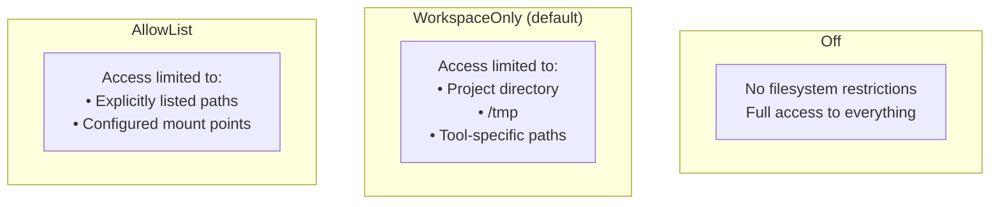
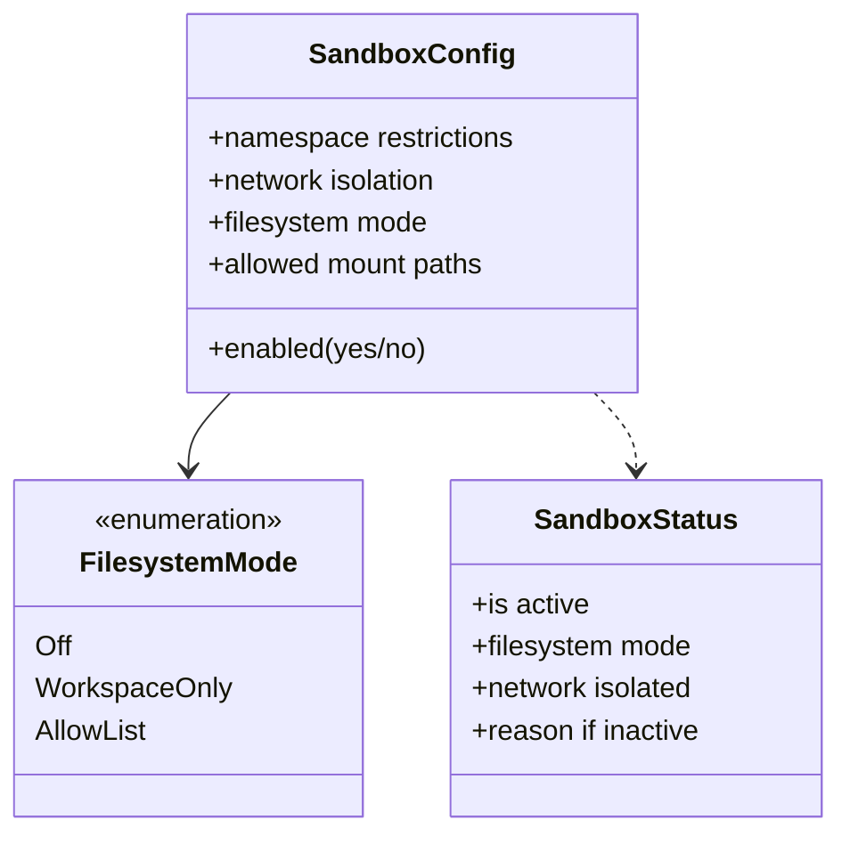
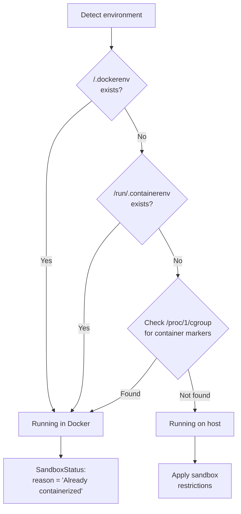
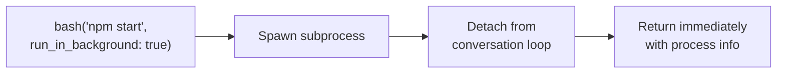

# 🛡️ Sandbox Execution

> **OS-level isolation.** How Claude Code contains bash commands to prevent damage.

[← Back to Main](../../README.md) | [← CLI & REPL](../11-cli-and-repl/README.md)

---

## Why Sandbox?

When an AI agent runs `bash` commands, it has the same power as the user. Sandboxing adds OS-level guardrails to prevent accidental (or adversarial) damage — filesystem isolation, network restrictions, and namespace confinement.

---

## Sandbox Architecture



---

## Filesystem Isolation Modes



---

## Sandbox Configuration



---

## Container Detection

Before applying sandboxing, the system checks if it's already inside a container:



---

## Background Execution

Some bash commands run in the background (e.g., dev servers):



---

## Configuration Example

```json
{
  "sandbox": {
    "enabled": true,
    "filesystem_mode": "WorkspaceOnly",
    "network_isolation": false,
    "allowed_mounts": [
      "/usr/local/bin",
      "/home/user/.cargo"
    ]
  }
}
```

---

## What's Next?

- **[System Prompt Building →](../13-system-prompt-building/README.md)** — What context the sandbox operates within
- **[Permission Model →](../04-permission-model/README.md)** — Application-level access control

---

[← CLI & REPL](../11-cli-and-repl/README.md) | [Next: System Prompt Building →](../13-system-prompt-building/README.md)
