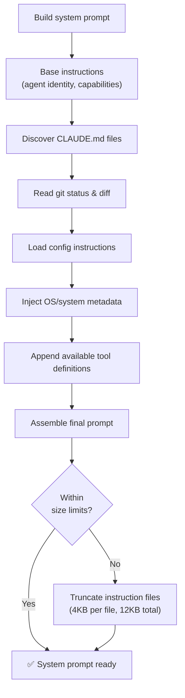
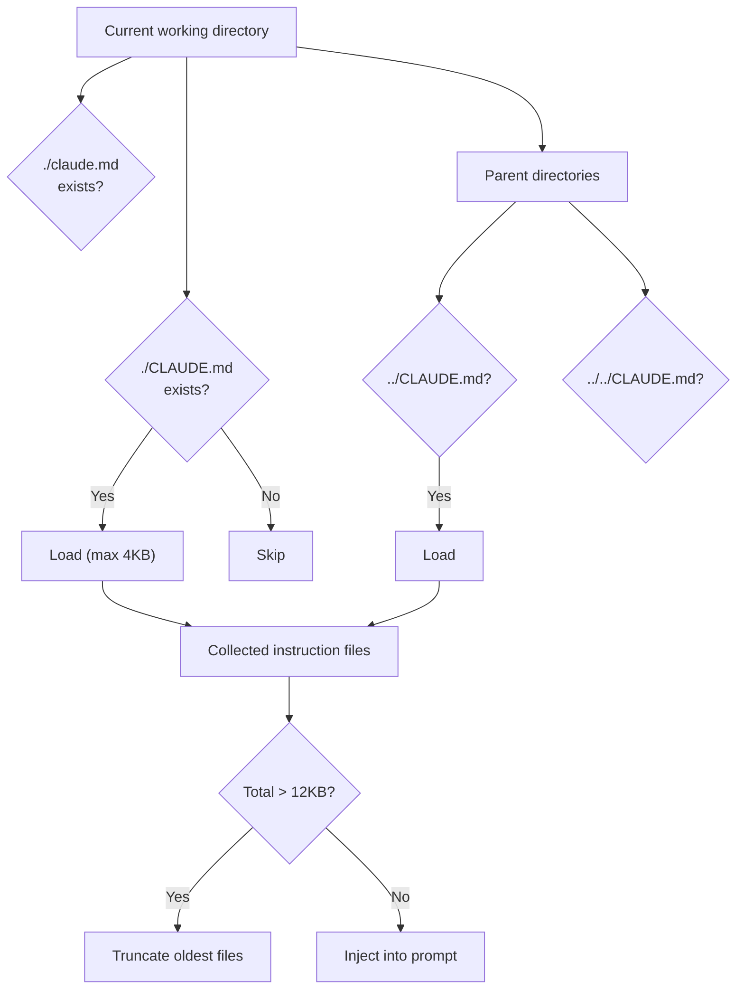
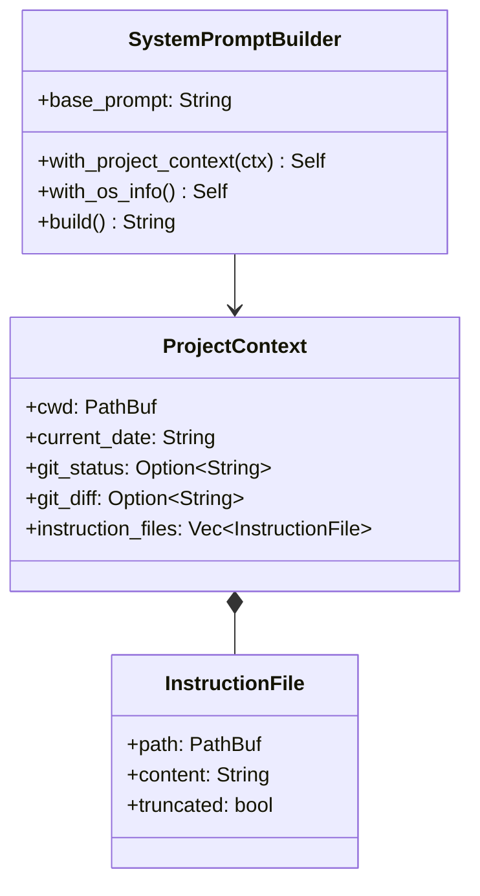
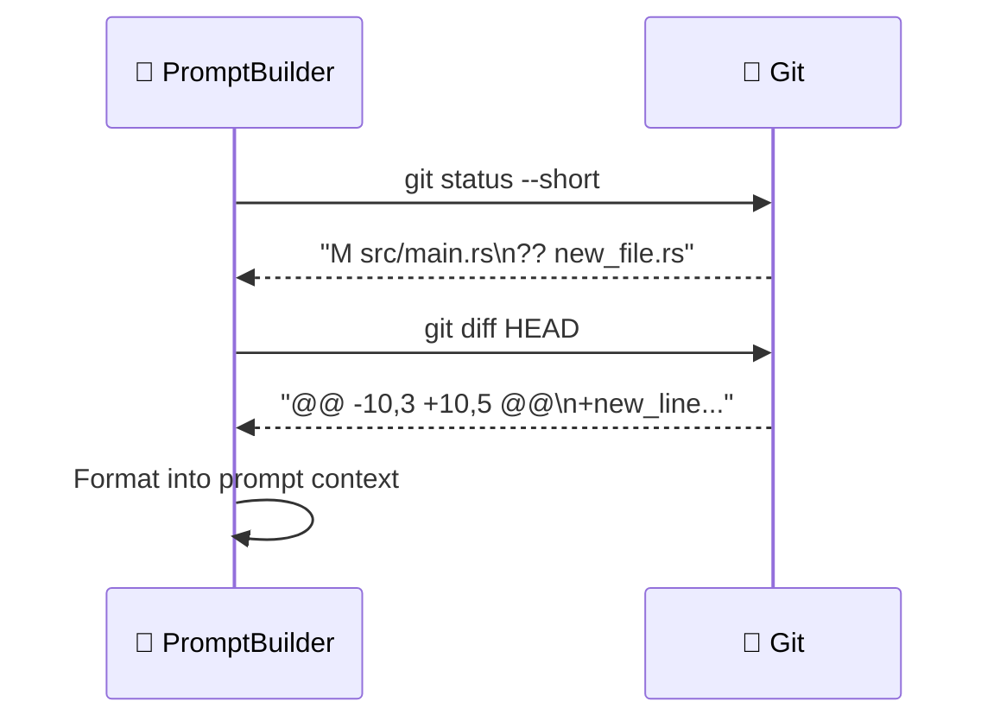

# 📝 System Prompt Building

> **Context injection.** How Claude Code dynamically constructs the system prompt with project context.

[← Back to Main](../../README.md) | [← Sandbox Execution](../12-sandbox-execution/README.md)

---

## Why Dynamic Prompts?

Unlike a static chatbot, Claude Code needs to know about *your* project — the directory structure, git status, coding standards, and custom instructions. The system prompt builder dynamically assembles all this context before every API call.

---

## Prompt Construction Flow



---

## CLAUDE.md Discovery

The system searches for instruction files in a specific order:



---

## ProjectContext — What Gets Injected



---

## System Prompt Structure

```
┌─────────────────────────────────────────────────┐
│ SYSTEM PROMPT                                   │
├─────────────────────────────────────────────────┤
│                                                 │
│ 1. Base Identity                                │
│    "You are Claude Code, an AI coding           │
│    assistant powered by Claude Opus 4.6..."     │
│                                                 │
│ 2. Project Context                              │
│    Working directory: /Users/dev/project        │
│    Date: 2026-04-02                             │
│                                                 │
│ 3. Git Status                                   │
│    On branch: main                              │
│    Modified: 3 files                            │
│                                                 │
│ 4. Instruction Files (CLAUDE.md)                │
│    "This project uses Rust. Run tests with      │
│    cargo test --workspace..."                   │
│                                                 │
│ 5. OS/System Info                               │
│    Platform: darwin, macOS 15.2                  │
│                                                 │
│ ─── DYNAMIC BOUNDARY ───                        │
│                                                 │
│ 6. Tool Definitions                             │
│    [18 built-in + MCP tools]                    │
│                                                 │
└─────────────────────────────────────────────────┘
```

---

## Git Integration in Prompts



This gives the model awareness of:
- Current branch
- Uncommitted changes
- New untracked files
- Recent modifications

---

## Size Limits

| Component | Limit |
|-----------|-------|
| Single instruction file | 4 KB |
| Total instruction files | 12 KB |
| Git status | Truncated if too long |
| Git diff | Truncated if too long |
| Dynamic boundary | Marks where tools are injected |

---

## What's Next?

- **[Slash Commands →](../14-slash-commands/README.md)** — Commands like `/memory` interact with prompt context
- **[Config System →](../09-config-system/README.md)** — Where CLAUDE.md paths are configured

---

[← Sandbox Execution](../12-sandbox-execution/README.md) | [Next: Slash Commands →](../14-slash-commands/README.md)
