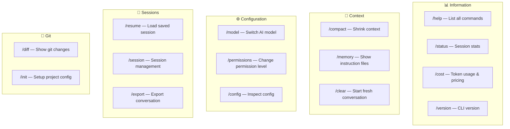
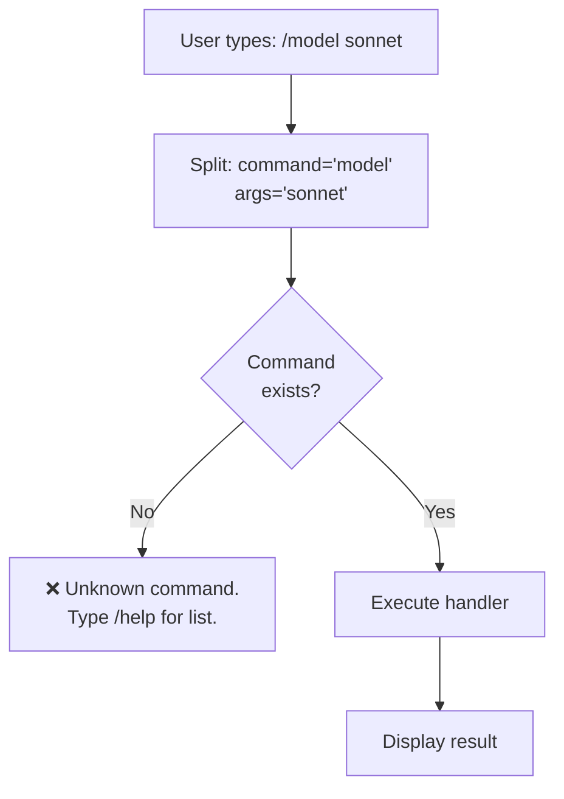
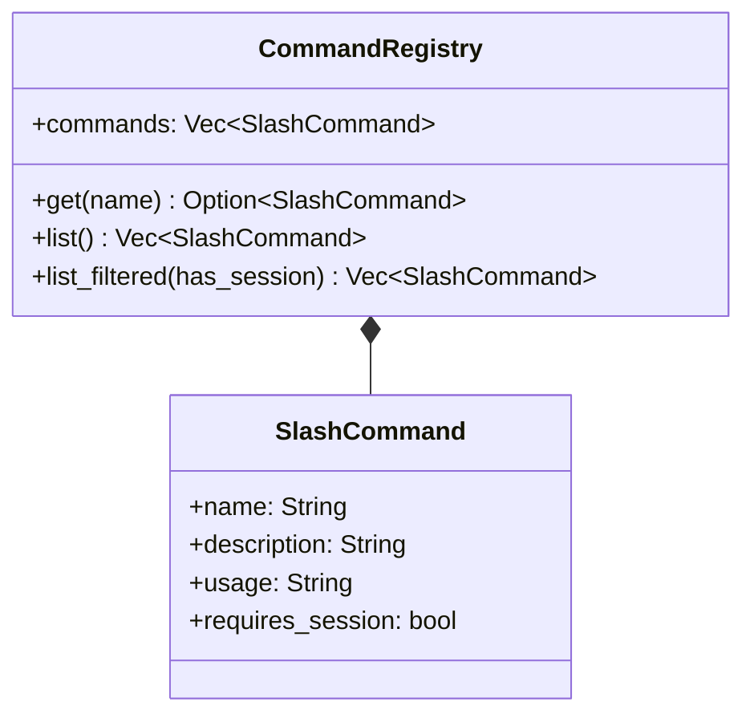
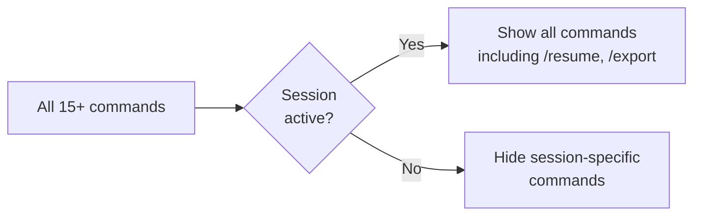

# ⌨️ Slash Commands

> **Quick controls.** The command registry that lets you switch models, compact memory, and manage sessions without leaving the REPL.

[← Back to Main](../../README.md) | [← System Prompt Building](../13-system-prompt-building/README.md)

---

## Command Overview

Slash commands are prefixed with `/` and executed in the REPL. They provide quick access to runtime controls without needing to ask the AI.

---

## Full Command Registry



---

## Command Parsing Flow



---

## Command Details

### `/compact` — Memory Shrinking
```
> /compact
Compacting conversation... ✓
Removed 12 messages, preserved 5 recent.
Context reduced from 180K → 45K tokens.
```

### `/model` — Switch Models
```
> /model sonnet
Switched to claude-sonnet-4-6

> /model haiku
Switched to claude-haiku-4-5-20251213

> /model opus
Switched to claude-opus-4-6
```

### `/cost` — Usage Tracking
```
> /cost
Session Usage:
  Input tokens:  45,230 ($0.68)
  Output tokens: 12,450 ($0.93)
  Cache reads:    8,200 ($0.01)
  Total cost:    $1.62
```

### `/permissions` — Permission Control
```
> /permissions read-only
Permission mode changed to ReadOnly

> /permissions danger-full-access
Permission mode changed to DangerFullAccess
```

### `/status` — Session Info
```
> /status
Model: claude-opus-4-6
Permission: DangerFullAccess
Messages: 24
Tokens: 89,450 input / 15,230 output
Session: abc123-def456
```

---

## Command Registration — Class Diagram



---

## Context-Aware Filtering

Some commands only appear when relevant:



---

## What's Next?

- **[Error Handling →](../15-error-handling-and-retry/README.md)** — What happens when things go wrong
- **[Memory & Context →](../02-memory-and-context/README.md)** — How `/compact` works internally

---

[← System Prompt Building](../13-system-prompt-building/README.md) | [Next: Error Handling →](../15-error-handling-and-retry/README.md)
