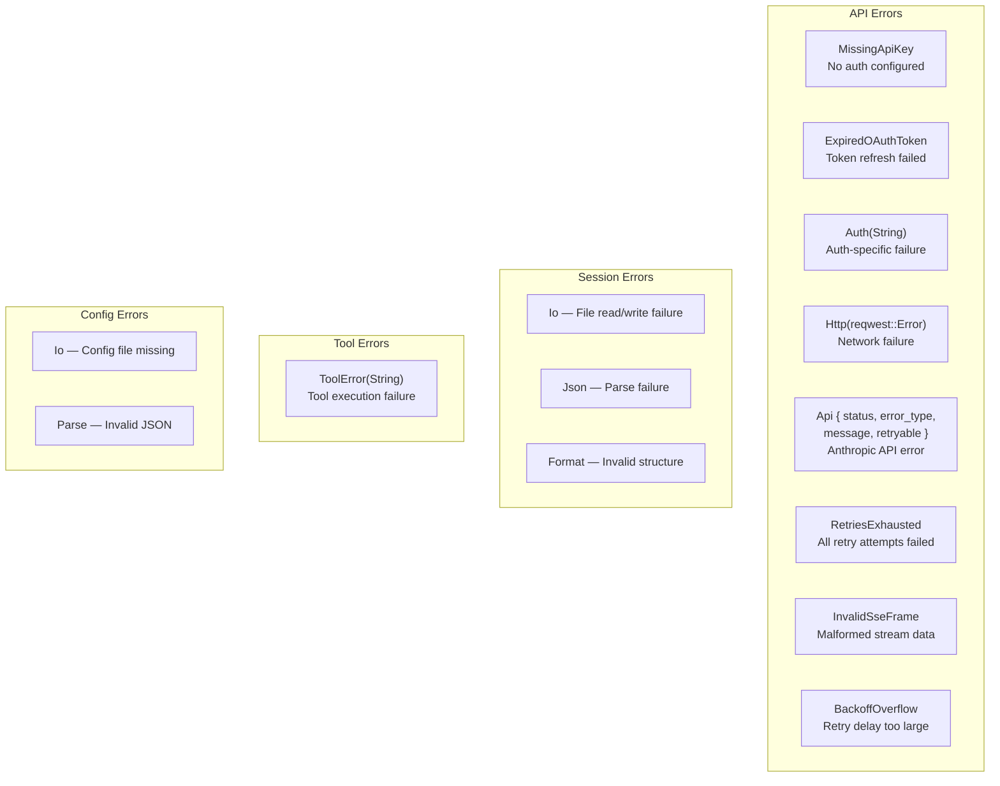
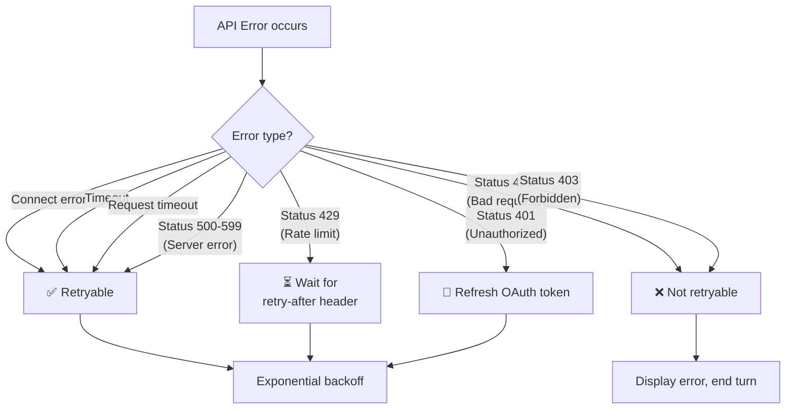
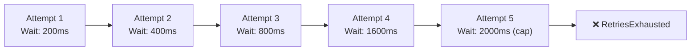
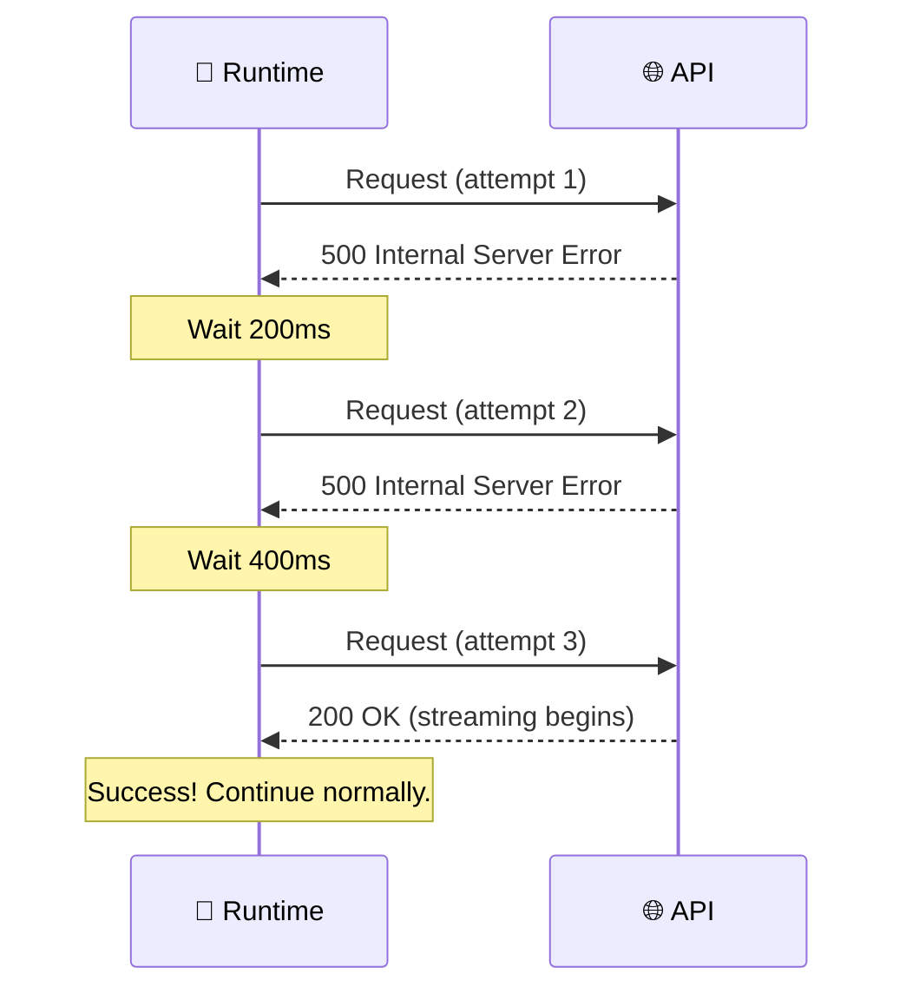
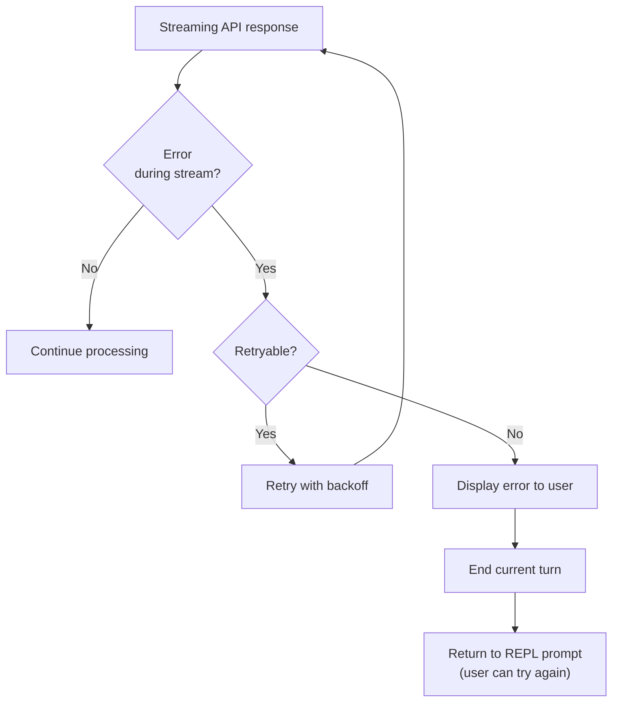

# 🔄 Error Handling & Retry Logic

> **Resilience by design.** How Claude Code handles failures, retries intelligently, and recovers gracefully.

[← Back to Main](../../README.md) | [← Slash Commands](../14-slash-commands/README.md)

---

## Error Type Taxonomy



---

## Retryability Decision Tree



---

## Exponential Backoff Strategy



```
┌──────────────────────────────────────────────┐
│ Retry Configuration                          │
├──────────────────────────────────────────────┤
│ Initial delay:    200ms                      │
│ Multiplier:       2x                         │
│ Max delay:        2,000ms (2 seconds)        │
│ Max attempts:     5                          │
│ Jitter:           None (deterministic)       │
└──────────────────────────────────────────────┘
```

---

## Retry Sequence Diagram



---

## Error Flow in the Conversation Loop



---

## Error Display to User

Different error types produce different user-facing messages:

| Error | User Sees |
|-------|-----------|
| MissingApiKey | "No API key configured. Set ANTHROPIC_API_KEY or run /login" |
| ExpiredOAuthToken | "OAuth token expired. Run /login to re-authenticate" |
| Rate limit (429) | "Rate limited. Waiting 30s before retrying..." |
| Server error (500) | "API server error. Retrying..." (automatic) |
| RetriesExhausted | "Failed after 5 attempts. Please try again." |
| InvalidSseFrame | "Received malformed response. Retrying..." |
| Network error | "Connection failed. Check your internet connection." |

---

## What's Next?

- **[Bootstrap Lifecycle →](../16-bootstrap-lifecycle/README.md)** — Error handling during startup
- **[Streaming & SSE →](../08-streaming-and-sse/README.md)** — Where stream errors originate

---

[← Slash Commands](../14-slash-commands/README.md) | [Next: Bootstrap Lifecycle →](../16-bootstrap-lifecycle/README.md)
