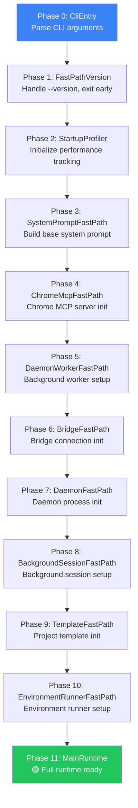
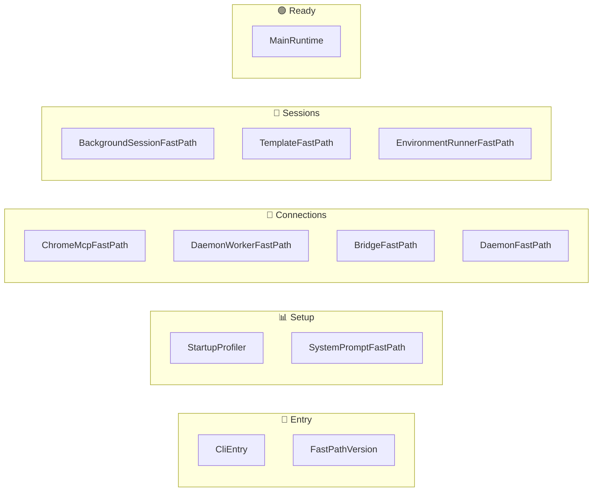
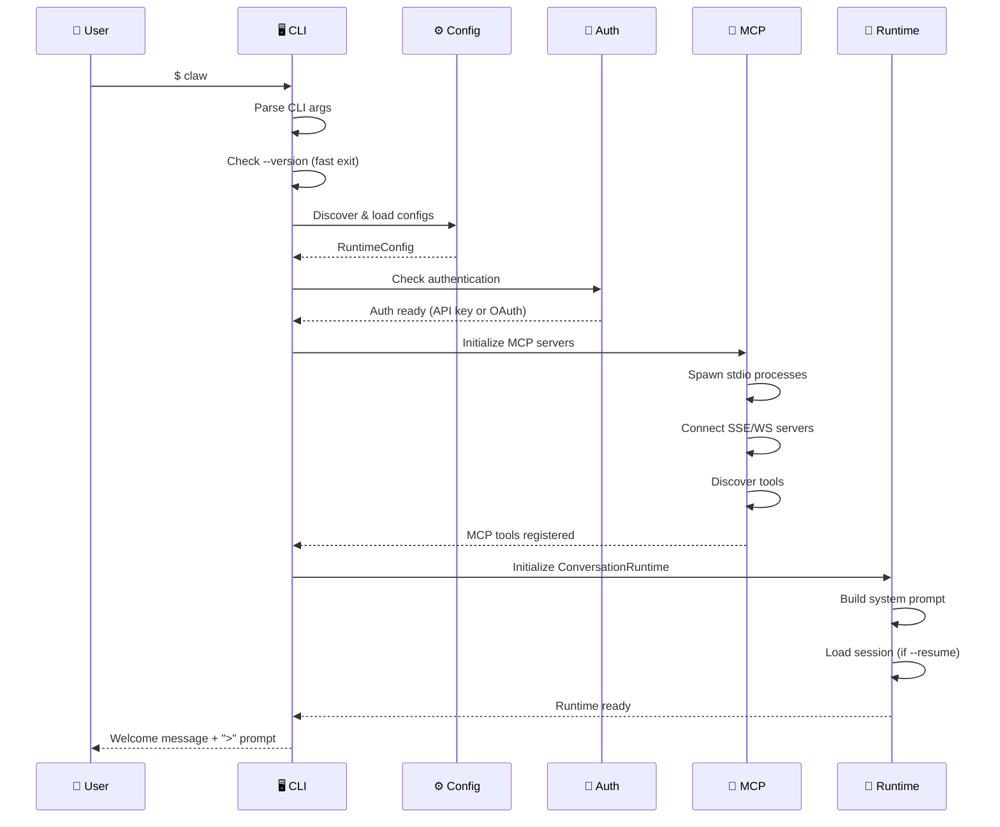
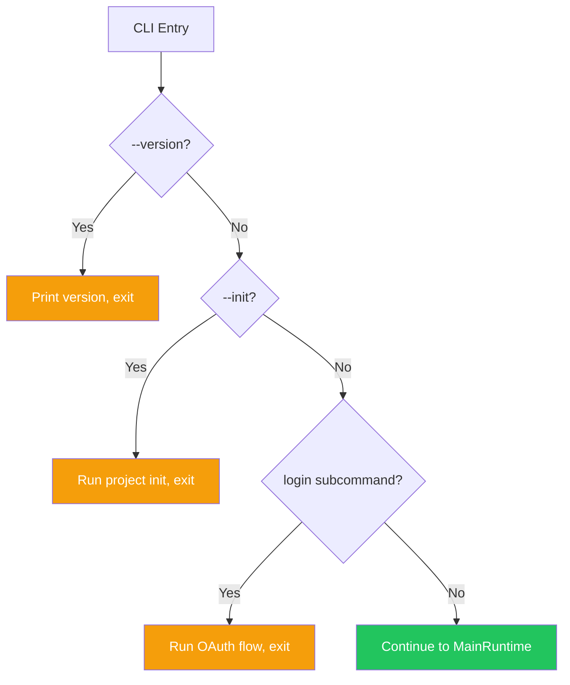

# 🚀 Bootstrap Lifecycle

> **From zero to ready.** The ordered startup sequence that initializes everything before the first prompt.

[← Back to Main](../../README.md) | [← Error Handling](../15-error-handling-and-retry/README.md)

---

## What Is Bootstrap?

When you type `claw` and hit enter, a lot happens before you see the `>` prompt. The bootstrap lifecycle defines 12 ordered phases that initialize config, auth, MCP servers, and the conversation runtime.

---

## Bootstrap Phases



---

## Phase Categories



---

## Startup Sequence Diagram



---

## Bootstrap Plan — Deduplication

The bootstrap plan ensures each phase runs exactly once, even if referenced multiple times:

```
┌────────────────────────────────────────────┐
│ BootstrapPlan                              │
├────────────────────────────────────────────┤
│ phases: Vec<Phase>  (ordered, unique)      │
│                                            │
│ Dedup: If same phase added twice,          │
│        second instance is silently dropped │
└────────────────────────────────────────────┘
```

---

## Fast Path Exits

Several phases support "fast path" exits — completing the request without reaching the full runtime:



---

## What's Next?

You've reached the end of the deep dives! Here's where to go from here:

- **[Back to Architecture Overview →](../00-architecture-overview/README.md)** — See how it all fits together
- **[Back to Main README →](../../README.md)** — Full table of contents

---

[← Error Handling](../15-error-handling-and-retry/README.md) | [Back to Main →](../../README.md)
